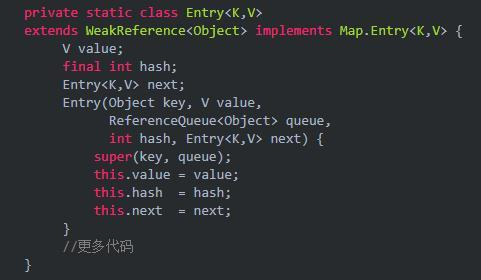
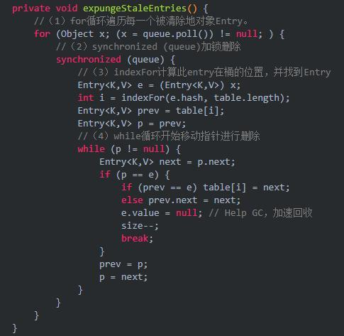

#一. 什么是WeakHashMap？

从名字可以得知主要和Map有关，不过还有一个Weak，我们就更能自然而然的想到这里面还牵扯到一种弱引用结构，因此想要彻底搞懂，我们还需要知道四种引用。如果你已经知道了，可以跳过。

1. 四种引用

在jvm中，一个对象如果不再被使用就会被当做垃圾给回收掉，判断一个对象是否是垃圾，通常有两种方法：引用计数法和可达性分析法。不管是哪一种方法判断一个对象是否是垃圾的条件总是一个对象的引用是都没有了。

JDK.1.2 之后，Java 对引用的概念进行了扩充，将引用分为了：强引用. 软引用. 弱引用. 虚引用4 种。而我们的WeakHashMap就是基于弱引用。

（1）强引用

如果一个对象具有强引用，它就不会被垃圾回收器回收。即使当前内存空间不足，JVM也不会回收它，而是抛出 OutOfMemoryError 错误，使程序异常终止。比如String str = "hello"这时候str就是一个强引用。

（2）软引用

内存足够的时候，软引用对象不会被回收，只有在内存不足时，系统则会回收软引用对象，如果回收了软引用对象之后仍然没有足够的内存，才会抛出内存溢出异常。

（3）弱引用

如果一个对象具有弱引用，在垃圾回收时候，一旦发现弱引用对象，无论当前内存空间是否充足，都会将弱引用回收。

（4）虚引用

如果一个对象具有虚引用，就相当于没有引用，在任何时候都有可能被回收。使用虚引用的目的就是为了得知对象被GC的时机，所以可以利用虚引用来进行销毁前的一些操作，比如说资源释放等。

我们的WeakHashMap是基于弱引用的，也就是说只要垃圾回收机制一开启，就直接开始了扫荡，看见了就清除。

2. 为什么需要WeakHashMap

WeakHashMap正是由于使用的是弱引用，因此它的对象可能被随时回收。更直观的说，当使用 WeakHashMap 时，即使没有删除任何元素，它的尺寸. get方法也可能不一样。比如：

（1）调用两次size()方法返回不同的值；第一次为10，第二次就为8了。

（2）两次调用isEmpty()方法，第一次返回false，第二次返回true；

（3）两次调用containsKey()方法，第一次返回true，第二次返回false；

（4）两次调用get()方法，第一次返回一个value，第二次返回null；

是不是觉得有点恶心，这种飘忽不定的东西好像没什么用，试想一下，你准备使用WeakHashMap保存一些数据，写着写着都没了，那还保存个啥呀。

适用场景：**不过有一种场景，最喜欢这种飘忽不定、一言不合就删除的东西。那就是缓存。在缓存场景下，由于内存是有限的，不能缓存所有对象，因此就需要一定的删除机制，淘汰掉一些对象。**

现在我们已经知道了WeakHashMap是基于弱引用，其对象可能随时被回收，适用于缓存的场景。下面我们就来看看，WeakHashMap是如何实现这些功能。

#二. WeakHashMap工作原理

1. WeakHashMap为什么具有弱引用的特点：随时被回收对象

这个问题就比较简单了，我们的目的主要是验证。WeakHashMap是基于弱引用的，肯定就具有了弱引用的性质。我们去他的源码中看一下：

从这里我们可以看到其内部的Entry继承了WeakReference，也就是弱引用，所以就具有了弱引用的特点。不过还要注意一点，那就是ReferenceQueue，他的作用是GC会清理掉对象之后，引用对象会被放到ReferenceQueue中。

2. WeakHashMap中的Entry被GC后，WeakHashMap是如何将其移除的？

意思是某一个Entry突然被垃圾回收了，这之后WeakHashMap肯定就不能保留这个Entry了，那他是如何将其移除的呢？

WeakHashMap内部有一个expungeStaleEntries函数，在这个函数内部实现移除其内部不用的entry从而达到的自动释放内存的目的。因此我们每次访问WeakHashMap的时候，都会调用这个expungeStaleEntries函数清理一遍。这也就是为什么前两次调用WeakHashMap的size()方法有可能不一样的原因。我们可以看看是如何实现的：

首先GC每次清理掉一个对象之后，引用对象会被放到ReferenceQueue中。然后遍历这个queue进行删除即可。

当然。WeakHashMap的增删改查操作都会直接或者间接的调用expungeStaleEntries()方法，达到及时清除过期entry的目的。

三. WeakHashMap的使用

1. 缓存中使用

在文章一开始提到WeakHashMap可以在缓存中使用。下面我们看一下如何使用的：

本案例来源于一个外国兄弟写的，很棒。由于不能包含链接，因此会在评论区给出。

2. 不要使用基础类型作为WeakHashMap的key

缓存的使用案例太多了，这里举一个WeakHashMap使用不规范的例子。

objectMap.put方法执行的时候i会被封装为Integer类型的，Integer保留了-128到127的缓存。但是对于int来说范围大很多，因此那些Key <= 127的Entry将不会进行自动回收，但是那些大于127的将会被回收，因此最后的尺寸总是会稳定在128左右。

OK。今天的文章先说到这。如有问题还请批评指正。目前名称已由“java的架构师技术栈”改名为“愚公要移山”。感谢各位的支持。