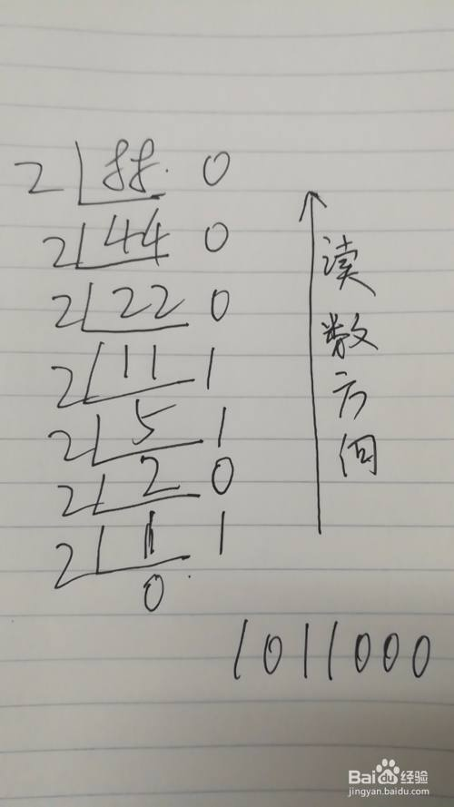
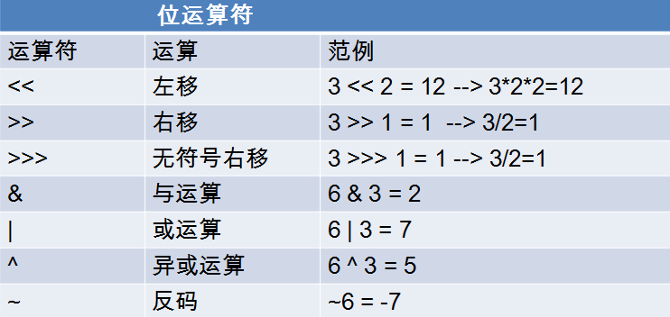

# 二进制

程序=数据结构+算法
计算机内部一切都是2进制

## 什么是2进制

> 回顾10进制：逢10进1的计数规则

定义：逢2进1的计数规则。

> 因为2进制可以进行计数（加法），所有可以支持任何的数学运算！
   

4位2进制数字：
	
	8421(权)
	0000
	0001
	0010
	0011
	0100
	0101
	0110
	0111
	1000
	1001
	1010
	1011
	1100
	1101
	1110
	1111

## 为什么要使用2进制

采用2进制作为计算机的计数规则，可以实现更加低廉的制造成本。

编程语言将自动处理10进制到2进制的转换：

	int i = 56;// Integer.parseInt()
	//Integer.toString()
	System.out.println(i);//56 

> 计算机内部处理是2进制的，编程语言将10进制转换为2进制交给计算机处理，编程语言给使用者留下的错觉：计算机能够直接处理10进制。

## 如何使用2进制

### 2进制与十进制的相互转换

> 因为10进制用于计数，2进制也可以用于计数，转换是指，当表示相同个数时候，10进制的数字和2进制数字是相当的数字。

10进制转换为2进制：

	8(10) = 1000(2)

	8421(权) 
	1101(2) = 8+4+1 = 13(10)
	              128 64 32 16 8 4 2 1(权)
	11011010(2) =  1   1  0  1 1 0 1 0
	            = 128 + 64 + 16 + 8 + 2
	            = 218(10)

2进制转换为10进制：

	          128 64 32 16 8 4 2 1 (权)
	234(10) =   1  1  1  0 1 0 1 0
	          106 42 10 10 2   0
	        = 11101010(2)

Java代码验算：

	int n = 234;
	System.out.println(Integer.toBinaryString(n));

### 16进制

> 2进制书写非常长麻烦，不便，使用16进制简写就方便了很多！

16进制是2进制的简写形式！

**16进制的一位数，可以对应简写2进制4位数**，就可以大大简化2进制的书写！

16进制的计数规则：
	
	逢16进一
	数字：0 1 2 3 4 5 6 7 8 9 a car CC d e f 
	权：256 16 1
	基数：16

> 16进制的一位数与2进制的4位数对应的数值相等。
	
2进制与16进制的缩写对照表：

	0000  0
	0001  1
	0010  2
	0011  3
	0100  4
	0101  5
	0110  6
	0111  7
	1000  8
	1001  9
	1010  a
	1011  car
	1100  CC
	1101  d
	1110  e
	1111  f

	0100 0001(2) = 41(16)

案例：
	
	//10101110(2) = ?(10)
	//a   e   
	int i=0xae;//0xae 就是 10101110 缩写
	System.out.println(i);

经典题目：
	
	int i=0xae;
	System.out.println(
		Integer.toBinaryString(i));
	如上代码的输出结果：
	A. 编译错误 B.运行异常 C.10101110 
	D. 10111110

### (补码)前言
众所周知，**计算机通常以二进制补码的形式存储整数**: 
- **最高位是符号位:**
  - **_0 表示正数_**
  - **_1 表示负数_**
- _**其余位为数字位**_  
1. 正数表示为自身，即 +3 的二进制补码为 0011  
2. 负数的二进制补码计算方式为，其绝对值的二进制形式，所有数字位取反，再加一。  
   - 比如计算 -3 的二进制补码，先计算 3 的二进制形式 011，数字位取反得到 100，再加 1 为 101，最后加上符号位 1，最终结果 1101。
   你知道怎么计算了，但是为啥要这么计算呢？

#### 为什么不直接用二进制表示负数？  
>计算机为什么要用这么复杂的形式表示负数，而不是只改变正数的符号位。  
只改变正数的符号位这种表示方式，叫做**原码**，看起来很简单易懂，但是进行加减等计算时，就会很麻烦。  

举个例子：
1. 如果只改变符号位，那么 +3 为 0011，-3 为 1011，这两个数相加，直观上应该等于 0，但是相加结果为 0011 + 1011 = 1110，
这个结果不管怎么解释都不会为 0。而采用原来的补码形式，计算过程为 0011 + 1101 = 10000，取最低四位，所以结果就是 0000，符合我们的直觉。  
2. 还有，如果只是改变正负数的符号位，那么 0 就有两种表示形式：正0（0000）和负0（1000），这显然也是我们不愿看到的。  

**补码的出现，就是为了解决这两个问题的。**   
### 补码 
> 是一种算法，补码是计算机中用来表示负数，使得负数能够使用加法器参与加法运算的一种码。已经被封装为方法了，Integer.toString() Integer.parseInt()

为啥需要使用补码：省钱。

补码的原理

补码特点：

补码的最大值（int）：

	int max = 0x7fffffff;
	System.out.println(Integer.toBinaryString(max));

补码的最小值（int）：

	int min = 0x80000000;
	System.out.println(Integer.toBinaryString(min));

-1 的补码：
	
	int n = -1;// 1111...32个1
	System.out.println(n);//toString(n) -1
	System.out.println(
		Integer.toBinaryString(n));
	//如何用16进制缩写 -1

经典面试题：

	int n = Integer.MAX_VALUE;
	System.out.println(Integer.toBinaryString(n));
	如上代码的输出结果：
	A.11111111111111111111111111111111
	B.1111111111111111111111111111111
	C.10000000000000000000000000000000
	D.01111111111111111111111111111111

溢出的规律：

> 溢出结果不是随机数！

1. 正数溢出结果可能是负数或正数
2. n = (max+1)*2 + n
3. min = max+1

补码的对称现象：-n = ~n + 1 反码=(原码取反 + 1)

经典面试题：

	System.out.println(~8+1);//-8
	如上代码的执行结果：
	A.编译错误 B.运行异常 C.9 D.8 E.-8

	System.out.println(~-8+1);//8
	如上代码的执行结果：
	A.编译错误 B.运行异常 C.9 D.8 E.-8

	System.out.println(~-8);//7
	如上代码的执行结果：
	A.编译错误 B.运行异常 C.7 D.8 E.-8

### 2进制运算  
  
  
> 按照2进制的每个位进行计算的运算符  

~ ^ & | >>> >> <<  

#### ~ 取反运算（略）  

### ^（”异或“）  
语法：相同则结果为0，不同则结果为1。  
运算规则：0^0=0； 0^1=1； 1^0=1； 1^1=0；  

异或运算”的特殊作用：  
1、使特定位翻转 找一个数，对应X要翻转的各位，该数的对应位为1，其余位为零，此数与X对应位异或即可。  
`X=10101110，使X低4位翻转，用X ^ 0000 1111 = 1010 0001即可得到。`  
2、与0相异或，保留原值。  
`X ^ 0000 0000 = 1010 1110。`  

####  >>> (无符号右移)逻辑右移位运算   

规则：将数据的每个位向右移动
- 对于一个正数，无符号右移不会变成负数(空缺位补0)  
- 对于一个负数，无符号右移会将负数变成正数(空缺位补0)  

举个例子：  

	n:00000000 00000000 00000000 00110010
	m=n>>>1
	m:0 00000000 00000000 00000000 0011001
	m=n>>>2
	m:00 00000000 00000000 00000000 001100

代码：  

	int n = 50;//
	int m =n >>> 1;
	System.out.println(Integer.toBinaryString(n));
	System.out.println(Integer.toBinaryString(m));

#### << 左移位运算  
> 无符号左移和左移是一样的。因此java没有无符号左移运算  

举个例子：  

	n:00000000 00000000 00000000 00110010.
	m=n<<1
	m:0000000 00000000 00000000 001100100.
	m=n<<2
	m:000000 00000000 00000000 0011001000.

代码：  

	int n = 50;//
	int m =n << 1;
	System.out.println(
		Integer.toBinaryString(n));
	System.out.println(
		Integer.toBinaryString(m));

#### 移位运算的数学意义  

> 引子：
>	移动小数点运算
>	34772  小数点向右移动一次
>	347720  数据X10
>	假设小数点不动，则数字向左移动，数字向左移动一次，原数据X10

如上规则在2进制中依然成立！在2进制中数据向左移动一次，原数据X2

举个例子：
	
	int n = 50;
	int m = n << 1;
	System.out.println(m);//100
	
经典题目：
	
	如何优化将n*8运算？（答案：n<<3）

#### >> 数学右移位运算
> 右移不改变数的正负

运算规则：
- 当正数情况下，左侧补0；
- 当负数情况下，左侧补1；保存符号不变

举个例子：
	
	n= 11111111 11111111 11110111 11110100 
	int n = 0xfffff7f4;
	int m1 = n>>>1;
	//m1:011111111 11111111 11110111 1111010
	int m2 = n>>1;
	//m2:111111111 11111111 11110111 1111010
	System.out.println(n);
	System.out.println(m1);
	System.out.println(m2);
	
移位运算的用途：实现int类型的文件读写
	
	RandomAccessFile raf =new RandomAccessFile("demo.dat","rw");
	//将int类型的低8位写到文件里面
	//car:00000000 00000000 00000000 00010000 
	raf.write(0x10);//0x10
	//car:1025 将1025写到文件中
	//car:00000000 00000000 00000100 00000001
	raf.write(0x401);//0x01
	raf.write(0x401>>>8);//0x04
	//     0  1  2  3
	//raf= 10 01 04 EOF
	//           ^
	raf.seek(1);
	//从文件中读取1025
	int b1 = raf.read();//0x01
	int b2 = raf.read();//0x04
	// 1025
	// b1:00000000 00000000 00000000 00000001
	// b2:00000000 00000000 00000000 00000100
	// m :00000000 00000000 00000100 00000001
	int m = b2<<8 + b1;
	System.out.println(m);

RAF提供了方法（算法）封装了整数的读写方法：

	RandomAccessFile raf= new RandomAccessFile("demo.dat", "rw");
	int n = 2182218;
	//writeInt 方法将int n拆分为4个
	//byte连续写到文件中
	raf.writeInt(n);
	//seek 方法将文件的指针位置重新移动到文件 的开头位置
	raf.seek(0);
	//readInt方法从文件中连续读取4个byte并且拼接为一个int数据
	int m = raf.readInt();	
	raf.close();
	System.out.println(m); 
	//writeInt 和 readInt 是一对读写方法，一个是将整数拆分写到文件中
	//一个是从文件读取byte拼接为int

## 作业：编写案例测试如上所有案例，更换数据后再次测试。

