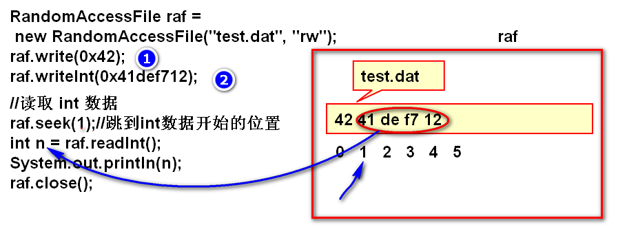
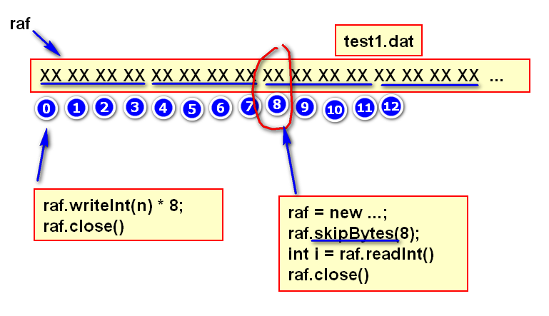
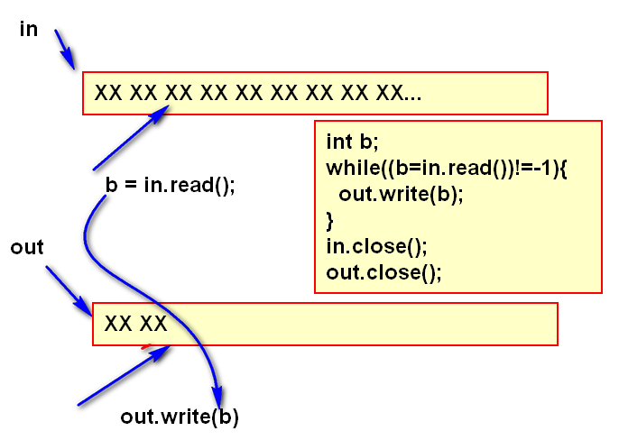
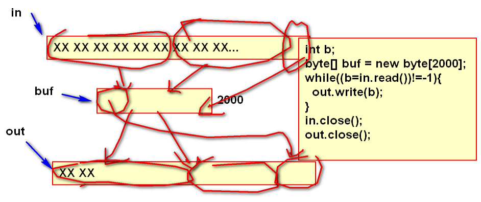

# 2进制

## >>> >> << ~

### & 与运算 

> 将两个数据对其的位进行“与”运算
	1 & 1 = 1
	1 & 0 = 0
	0 & 1 = 0
	0 & 0 = 0

案例：

	n=   01101101 10110111 10110110 11100101
	mask 00000000 00000000 00000000 11111111
	&---------------------------------------
	m    00000000 00000000 00000000 11100101
	
	mask: 面具， 掩码

代码：
	
	int n = 0x6db7b6e5;
	int mask = 0xff;
	int m = n & mask;//掩码运算
	System.out.println(
		Integer.toBinaryString(n));
	System.out.println(
		Integer.toBinaryString(mask));
	System.out.println(
		Integer.toBinaryString(m));

掩码运算：
	
	1. 用于将数据的一部分截取出来。
	2. 掩码运算结果是2整次幂余数。
		%2 ：&0x1 
		%4 : &0x3
		%8 : &0x7
		%16: &0xf

	0000 % 4 = 00   0000 & 0011 = 00
	0001 % 4 = 01   0001 & 0011 = 01
	0010 % 4 = 10   0010 & 0011 = 10
	0011 % 4 = 11   ...
	0100 % 4 = 00
	0101 % 4 = 01
	0110 % 4 = 10
	0111 % 4 = 11
	1000 % 4 = 00
	...

经典面试题：
	
	如何优化 n%8 运算的性能（答案：n&0x7）

案例：

	int i=0;
	System.out.println(i++ & 0x7);
	System.out.println(i++ & 0x7);
	System.out.println(i++ & 0x7);
	System.out.println(i++ & 0x7);
	System.out.println(i++ & 0x7);
	System.out.println(i++ & 0x7);
	System.out.println(i++ & 0x7);
	System.out.println(i++ & 0x7);

掩码运算用途
	
	将整数进行拆分

	n=01101101 01100100 11000011 00010001
	
	b1=00000000 00000000 00000000 01101101
	b2=00000000 00000000 00000000 01100100
	b3=00000000 00000000 00000000 11000011 
	b4=00000000 00000000 00000000 00010001

	b1=(n>>>24)&0xff;
	b2=(n>>>16)&0xff;
	b3=(n>>>8)&0xff;
	b4=(n>>>0)&0xff;

	合并b1, b2, b3, b4 为一个int

	int n = (b1<<24)|(b2<<16)|(b3<<8)|b4

### | 或运算
	
运算规则两个数按位对齐进行或运算

	
	1|1 = 1
	1|0 = 1
	0|1 = 1
	0|0 = 0

案例：

	b1=00000000 00000000 00000000 10110101
	b2=00000000 00000000 11011011 00000000
	|--------------------------------------
	n  00000000 00000000 11011011 10110101

	合并b1, b2, b3, b4 为一个int

	int n = (b1<<24)|(b2<<16)|(b3<<8)|b4

### 认识read()方法

	文件：
	00101011 01110111 11011011 11011011 
	0        1        2        3         ^

	int b1=raf.read();
	b1:00000000 00000000 00000000 00101011 
	b2=raf.read();
	b2:00000000 00000000 00000000 01110111 
	b3=raf.read();
	b3:00000000 00000000 00000000 11011011 
	b4=raf.read();
	b4:00000000 00000000 00000000 11011011 

	int m = b1|b2|b3|b4 >0

# 文件读写 RandomAccessFile

## write(int car) 向文件中写出一个byte

## int car = read() 从文件中读取一个byte

## write(byte[] buf) 向文件中写出一批byte

案例：将字符串写到文件中

	1. "今天你吃了吗？"
	2. 序列化为byte[]
	3. write(byte[] buf)

代码：
	
	RandomAccessFile raf = 
		new RandomAccessFile("demo.txt","rw");
	String str = "今天你吃了吗？";
	byte[] buf = str.getBytes("UTF-8");
	raf.write(buf);
	raf.close();

## int n = read(byte[] buf) 从文件中读取一批数据

原理
	
	RandomAccessFile raf = new ...;
	byte[] buf=new byte[200];
	//从文件raf中读取多个byte填充到buf数组中，返回值n表示填充个数
	int n = raf.read(buf);
	System.out.println(n);
	//n表示，200个字节中前n个是有效的
	String str = 
		new String(buf,0,n,"utf-8");
	System.out.println(str);
	raf.close();

## 控制文件读写位置 getFilePointer seek

# RandomAccessFile 总结

1. 可以操作文件内容
2. 可以任意移动文件指针，读写文件。
3. 每次读写1个byte
4. 提供了 基本数据类型的 读写方法
	- 基本类型读写的底层:每次读写1个byte

缺点：没有提供更复杂数据的读写方法。

# 流（Stream）

流是一套API（灰常多）,提供了各种类型数据的读写API！流是一套可扩展的API，通过扩展的API支持了各种类型数据的读写。

流是从两个抽象类扩展的：

- InputStream 输入流
	- read()
	- read(byte[] buf)
- OutputStream 输出流
	- wirte(int car)
	- write(byte[] buf)

## InputStream 输入流

输入流是抽象类，所有的输入扩展流都扩展于InputStream。

InputStream 定义了基本的数据读取方法 read 其读取规则与 RAF 中的read规则一致。

InputStream是抽象类，不能直接使用，使用的都是其子类。

## OutputStream 输出流

输出流是抽象类，所有的输出扩展流都扩展于OutputStream。

OutputStream 定义了基本的数据写出方法 write 其写出规则与 RAF 中的write规则一致。

OutputStream是抽象类，不能直接使用，使用的都是其子类。

## FileOutputStream 文件输出流(低级流)

文件输出流是 OutputStream 的子类，实现了其约定的抽象方法：write

使用文件流可以向文件写出数据。

### 构造器

文件流的构造器必须给定被写出的文件名

- FileOutputStream(Stirng filename)
- FileOutputStream(File file)

重载的构造器可以按照追加的方式打开文件，打开以后文件的写入位置在文件的末尾，写出数据追加到文件的末尾。

- FileOutputStream(Stirng filename, boolean append )
- FileOutputStream(File file, boolean append )

> 文件输出流在打开文件时候，如果文件不存在就创建文件，如果不是追加方式时候就将文件的内容清空，重写写文件。如果文件名是一个目录，这时候抛出异常！

文件输出的API方法

- read(int car) 向文件中写出一个byte
- read(byte[] car) 向文件中写出一批byte
- read(byte[] car, 0, length) 将byte数组的一部分写到文件中。

案例：
	
	FileOutputStream out = 
		new FileOutputStream("demo.txt");
	out.write("Hello World!".getBytes());
	out.close();//使用后务必关闭文件流

### FileInputStream 文件输入流(低级流)

文件输入流继承了抽象类InputStream，实现了其全部的抽象方法。可以从文件中读取byte数据。

构造器

- FileInputStream(File file)
- FileInputStream(String filename)

> FileInputStream构造器用于以读取的方式打开文件，如果文件不存在（或者是目录）则抛出文件没有找到的异常！

API方法

- int read() 从文件中读取一个byte数据
- int read(byte[] buf) 从文件中读取一批数据到byte数组中，返回读取的数量

> 文件输入流只能从文件中读取byte数据，如果希望能够读取更复杂的数据，需要使用扩展流实现。读取方法返回-1表示读取到文件的末尾。

案例：

	FileInputStream in =
	   new FileInputStream("demo.txt");
	int car;
	while((car=in.read())!=-1){
		System.out.print((char)car);
	}
	in.close();

案例：利用输入输出流实现文件的复制：

代码：

	FileInputStream in = 
		new FileInputStream("movie.flv");
	FileOutputStream out = 
		new FileOutputStream("new.flv");
	int n;
	byte[] buf = new byte[8*1024];//缓冲区
	while((n = in.read(buf))!=-1){
		out.write(buf, 0, n); 
	}
	in.close();
	out.close();
	System.out.println("完成！");

### 缓冲流

缓冲流是一种扩展流，其在基本的byte节点流的基础上扩展了自动化缓冲区管理功能。
使用缓冲流可以简化缓冲区的管理，提高流的IO性能。工作中使用的非常广泛。

> 缓冲流有两个类 BufferedInputStream 和BufferedOutputStream 分别是输入缓冲流和输出缓冲流。输入缓冲流为输入流扩展了缓冲区功能，输出缓冲流为输入流扩展了缓冲区功能。

构造器：

- BufferedInputStream(InputStream in)
- BufferedOutputStream(OutputStream out)

> 这两个缓冲流的构造器都必须依赖另外一个流作为参数，也就意味着缓冲流是对另外的流进行扩展。

API方法：

- BufferedInputStream
	- int read()
	- int read(byte[] buf)
	- close()
- BufferedOutputStream
	- write(int car)
	- write(byte[] buf)
	- write(byte[] buf, off, length)
	- close()
	- flush() 清空缓冲区方法

> 这些方法就是从 流继承的方法，这些方法封装了缓冲区的管理功能，能够自动化的管理缓冲区，使用这些方法可以就可以使用缓冲区了。

> 当关闭缓冲流时候，其内部的节点流也自动关闭, 如果忘记关闭缓冲流，会发生缓冲数据丢失的情况

> flush()方法可以清理缓冲区，将缓冲区中的数据写到文件中，其目的是保证数据可靠写入到文件，如果频繁调用此方法，则缓冲区就失去意义了。

