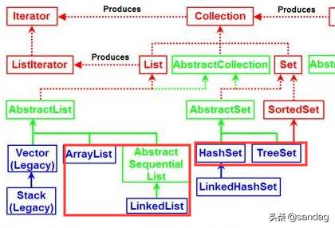
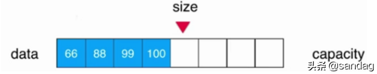
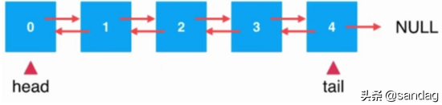
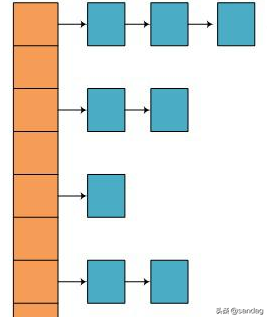
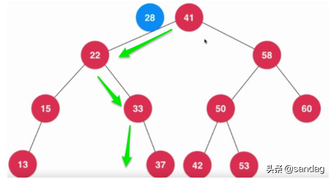

# 14. 考虑实现 Comparable 接口
- compareTo 方法并没有在 Object 类中声明。 相反，它是 Comparable 接口 中的唯一方法
- 它与 Object 类的 equals 方法在性质上是相似的，除了它允许在简单的相等比较之外的顺序比较，它是泛型的
- 通过实现 Comparable 接口，一个类表明它的实例有一个**自然顺序**（ natural ordering）。 对实现Comparable 接口的对象数组排序非常简单，
如下所示：  
`Arrays.sort(a);`
>Collections.sort和Arrays.sort的区别
Collections.sort专门给List排序，而Arrays.sort专门给数组进行排序。
Collections.sort排序底层调用的是Arrays.sort方法

## compareTo 方法的通用约定与 equals 相似：
>将此对象与指定的对象按照排序进行比较。 返回值可能为负整数，零或正整数，因为此对象对应小于，等于或大于指定的对象。
如果指定对象的类型与此对象不能进行比较，则引发 ClassCastException 异常。  
- compareTo方法比较必须满足：
  - sgn(x.compareTo(y)) == -sgn(y. compareTo(x)) （这意味着当且仅当 y.compareTo(x) 抛出异常时，x.compareTo(y) 必须抛出异常。）
    - 第一条规定，如果反转两个对象引用之间的比较方向，则会发生预期的
      事情：如果第一个对象小于第二个对象，那么第二个对象必须大于第一个; 如果第一个对象等于第二个，那么第二个
      对象必须等于第一个; 如果第一个对象大于第二个，那么第二个必须小于第一个
  - 可传递的： (x. compareTo(y) > 0 && y.compareTo(z) > 0) 意味着
    x.compareTo(z) > 0
    - 第二项约定说，如果一个对象大于第二个对象，而第二个对象大于第三个对象，则第一个对象必须大于第三个对象
  - x.compareTo(y) == 0 意味着 sgn(x.compareTo(z)) == sgn(y.compareTo(z))
    - 所有比较相等的对象与任何其他对象相比，都必须得到相同的结果
### 区别：
- equals 方法在所有对象上施加了全局等价关系，compareTo 不必跨越不同类型的对象：当遇到不同类型的对象时，compareTo 被允许抛出 ClassCastException 异常
  -  约定确实允许进行不同类型间比较: 由被比较的对象实现的接口中定义compareTo方法
### 注意事项：
1. 正如一个违反 hashCode 约定的类可能会破坏依赖于哈希的其他类一样，违反 compareTo 约定的类可能会破坏
  依赖于比较的其他类。 依赖于比较的类，包括排序后的集合 TreeSet 和 TreeMap 类，以及包含搜索和排序算法的
  实用程序类 Collections 和 Arrays 。
2. 子类继承父类+添加新组件，也应用"组合优于继承"处理
3. 前言：只是声明 compareTo 方法施加的相等性测试，通常应该返回与 equals 方法相同的结果。  
  - 如果违反，顺序关系被认为与 equals 不一致。 其 compareTo 方法强加与 equals
不一致顺序关系的类仍然有效，但是包含该类元素的被排序的集合(list通过Collections.sort()或者TreeSet自动排序)**可能**
不服从相应集合接口（Collection，Set 或 Map）的一般约定(这是由于这些接口的通用约定是用 equals 方法定义的)，
但是排序后的集合使用 compareTo 强加的相等性测试来代替 equals
(总结: compareTo与compareTo不一致时，**可能**优先用compareTo进行排序！例如，(此情况)HashSet使用equal排序，TreeSet使用compareTo排序)。
[参考]()：https://www.zhangshilong.cn/work/21129.html
4. 编写 compareTo 方法与编写 equals 方法类似，但是有一些关键的区别。
   - 因为 Comparable 接口是参数 化的， compareTo 方法是**静态式的类型**，所以你不需要输入检查(equal的o==null判断与强转)或者转换它的参数)。
   - 如果参数是错误的类型(不能像equal参数用Object，要是能比较的类型！)，那么调用将不会编译。
   - 如果参数为 null，则调用应该抛出一个 NullPointerException 异常，并且一旦该方法尝试访
     问其成员，它就会立即抛出这个异常。
5. 在 compareTo 方法中，比较属性的顺序而不是相等(返回一个+、0、-，而不是判断是否相等！)
6. 要比较**对象**引用属性，请**递归**调用 compareTo 方法。
7. 如果一个属性(field)没有实现 _Comparable_，或者 你需要一个非标准的顺序，那么使用 _Comparator_ 接口，可以编写自己
   的比较器或使用现有的比较器(**消除耦合，利于维护！**)
   1. 代码参考：https://vimsky.com/examples/usage/comparator-comparingint-in-java-with-examples.html

    
## 如何重写compareTo方法
1. 从最重要的属性开始，逐步比较所有的重要属性。 如果比较结果不是零（零表示相等），则表示比较完成; 只是返回结果。
2. 如果最重要的字段是相等的，比较下一个重要的属性，依此类推直到找到不相等的属性或比较剩余不那么重要的属性。

#### 参考：https://www.zhangshilong.cn/work/21129.html
今天，我们来谈谈收藏。面试的频率很高，发展的频率也很高。经常听人说List是有序的，Set是无序的，(都指顺序！不是排序) 那么这种有序和无序到底是什么意思呢？  

这里有两个概念。一个是访问元素的顺序。比如我存的时候是3 4 5 1 2，所以取出来的时候应该是3 4 5 1 2或者2 1 5 4 3。
另一个是容器中元素大小顺序，更准确地说是排序。如果我们区分这两个概念，就很容易说了。看上面的系统图。列表族中有两个将军，
数组列表和链接列表。在Set家族中，有两个将军，HashSet和TreeSet。  

ArrayList和LinkedList按照保存和取数的顺序属于一个有序集，因为ArrayList的底层是通过动态数组实现的，数组是一个连续的空间。
每次保存都会找到索引，一个一个存储，取数的时候根据索引遍历出来。  

链表也是如此，要么到链表头，要么到链表尾。由于存储和检索的顺序是有序的，很容易模拟堆栈(FIFO)和队列(FIFO)两种数据结构。
但是这两种结构无法对元素本身进行排序，这也决定了我在数组或者链表中很难找到最大值和最小值，或者元素之间没有规律的存储。  

同样，根据存储顺序，HashSet依赖于哈希存储。计算出哈希值后，会分散到不同的存储位置，也就是说在存储的时候，元素并不是紧挨着存储的，
而是根据每个元素的哈希值哈希到不同的位置。访问顺序无法保证，元素的排序顺序也无法保证，但优点是访问效率高。  

TreeSet依赖于树存储。在这种树形结构中，无论是二叉查找树树还是红黑树，在存储元素时，都会对元素本身进行比较，并根据大小(compareTo方法)放在合适的位置，
这意味着元素会根据树的性质进行存储，因此元素的存储和提取顺序无法保证。但是元素在存储的时候可以根据自己的大小进行排序，
这样就很容易找到最大值和最小值，以及给出一个元素，找到比他大和小的元素等操作。  

总结：
1. 按照元素的访问顺序，List是有序的，Set是无序的。  
2. 根据元素之间的关系，List是无序的(通过Collections.sort使其有序)，TreeSet是有序的。  
然而，HashSet是无序的(转成List通过Collections.sort使其有序、转成TreeSet自动排序)。  
