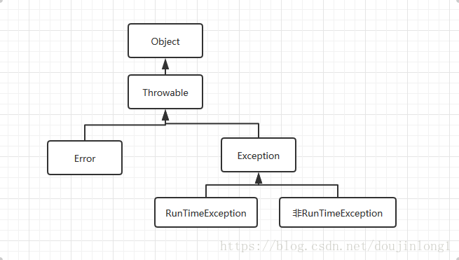

#9. 使用 try-with-resources 语句替代 try-finally 语句
## try-finally方式(Case01、Case02)：
`try {
    try{
    }
    finally {
    ...
} finally {
}
`
- 缺陷：
  - 在 firstLineOfFile 方法中，由于底层物理设备发生
    故障，对 readLine 方法的调用可能会引发异常，并且由于相同的原因，调用 close 方法可能会失败。 在这种
    情况下，第二个异常完全冲掉了第一个异常。 在异常堆栈跟踪中没有第一个异常的记录，这可能使实际系统中的调
    试非常复杂——通常这是你想要诊断问题的第一个异常。
## try-with-resources方式(Case03、Case04、Case05)：
`try () {
    }
`
`try () {
} catch() {
}
`
`try () {
    } catch(IOException e) {
} finally {
}
`
- 优势：
  - 如果调用 readLine 和（不可见） close 方法都抛出异常，则后一个异常将被抑制
    （suppressed），而不是前者。 事实上，为了保留你真正想看到的异常，可能会抑制多个异常。 这些抑制的异常没
    有被抛弃， 而是打印在堆栈跟踪中，并标注为被抑制了。 **你也可以使用 getSuppressed 方法以编程方式访问它
    们，该方法在 Java 7 中已添加到的 Throwable 中(throw e.printStackTrace)**。
  
## 补充：
### Java基础知识——异常Throwable和Exception
>Java设置了异常，旨在鼓励将方法中可能出现的异常告知给使用此方法的程序员（你和我！）。当然了，这种方法是比较优雅的，让我们确切的知道是在哪里出了错，并提供了异常捕获。本篇文章主要对Java中的异常进行介绍与区分。

**先上一张类图**  

这是异常的类图。  

Throwable是Error和Exception的父类，用来定义所有可以作为异常被抛出来的类。  
*             有三个比较常用的方法：  
*             1.String getMessage();返回一个简短的异常描述  
*             2.String toString();返回一个较为详细的异常描述  
*             3.void printStackTrace();jvm打印异常就是用的此方法，是最详细的  

#### Error和Exception区分：  
Error是编译时错误和系统错误，系统错误在除特殊情况下，都不需要你来关心，基本不会出现。而编译时错误，如果你使用了编译器，那么编译器会提示。  
Exception则是可以被抛出的基本类型，我们需要主要关心的也是这个类。  
Exception又分为RunTimeException和其他Exception。  
RunTimeException和其他Exception区分：  

其他Exception，受检查异常。可以理解为错误，必须要开发者解决以后才能编译通过，解决的方法有两种，1：throw到上层，2，try-catch处理。  
RunTimeException：运行时异常，又称不受检查异常，不受检查！不受检查！！不受检查！！！重要的事情说三遍，
因为不受检查，所以在代码中可能会有RunTimeException时Java编译检查时不会告诉你有这个异常，
但是在实际运行代码时则会暴露出来，比如经典的1/0，空指针等。如果不处理也会被Java自己处理。  