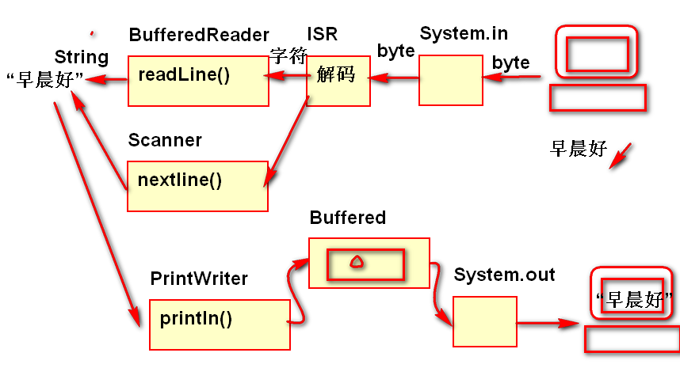
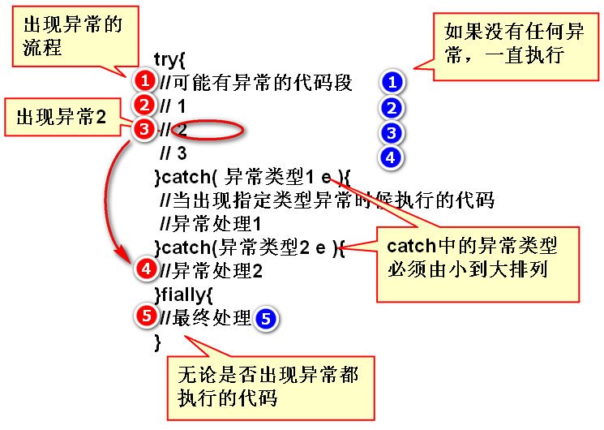
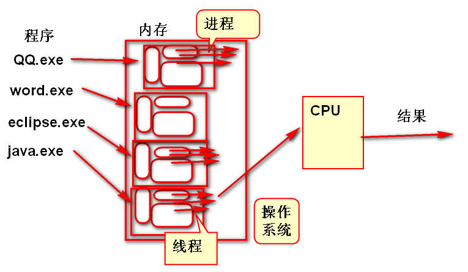
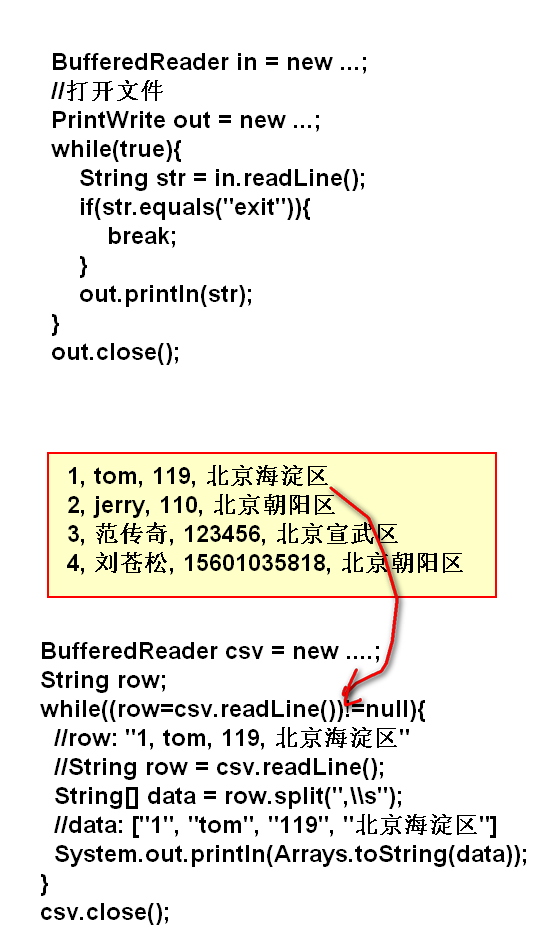

# IO

- File 创建，删除，改名，列目录，属性
- RandomAccessFile: 
	- 以byte为单位操作文件
	- 在byte读写基础之上扩展了基本类型的读写方法
	- 可以从文件的任意位置开始读写
- IO流：可扩展的API，可以扩展出任意数据类型的读写
- 扩展基类 InputStream OutputStream
- 节点流：数据开始的地方
	- 低级流，只能按照byte访问，不方便
	- FileInputStream
	- FileOutputStream
	- System.in 控制台输入流
	- System.out 控制台输出流
	- 网络流
- 扩展流（高级流）
    - 对象流：对象读写
    - 缓冲流：提供IO性能
    - 字符流：扩展了字符编码
        - 转换流
          - InputStreamReader 字符输入流
          - OutputStreamWriter 字符输出流
        - PrintWriter  写文本，依赖低级byte流-OutputStreamReader
        - BufferedReader 读文本，依赖低级byte流-InputStreamReader

控制台读写：

案例：
	
	InputStreamReader isr = 
		new InputStreamReader(System.in);
	//BufferedReader依赖于isr
	BufferedReader in = 
		new BufferedReader(isr);
	//从控制台读取一行文本信息
	String s = in.readLine();
	//System.out.println(s);
	//不要将操作系统控制台流关闭！
	
	/**
	 * autoFlush 参数，设置为true时候，
	 * 会在println方法执行结束以后自动
	 * 调用flush一次
	 */
	PrintWriter out = 
		new PrintWriter(System.out,true);
	out.println(s); 

---------------------------

# 异常

方法的意外（非正常）结果

## 意外结果返回方式

1. 利用特殊值带回
	- read() 当返回 -1 时是特殊情况
	- readLine() 当返回 null 时是特殊情况
2. 利用异常抛出
	- Scanner nextInt() 输入错误抛出异常

## Java 异常种类

- Throwable 可抛出的
	- Error 错误，系统不可恢复错误
		- OutOfMemoryError 堆内存溢出错误
	- Exception 例外, 异常
		- IOException
		- RuntimeException: 非检查异常

### 非检查异常

Java 编译器不检查RuntimeException及其子类的异常处理规则。不报编译错误。

其他异常（可检查异常）：当调用有异常抛出的方法，必须处理异常，否则将出现编译错误！

## try ... catch

程序一旦出现异常，Java异常就去寻找catch语句，处理异常。如果不使用catch处理，当前的线程也会停止。在程序中要合理的使用catch处理异常。

### try ... catch finally的语法

语法
	
	try{
		//可能有异常的代码段
	}catch( 异常类型1 e ){
		//当出现指定类型异常时候执行的代码
		//异常处理1
	}catch(异常类型2 e ){
		//异常处理2
	}fially{
		//最终处理
	}

### try ... catch finally 执行流程

执行流程案例

	try{
		String str = null;// "1天" "";
		// '0':48 '1':49 '2':50 '3':51
		// '0'-48 '1'-48 '2'-48 ...
		char CC = str.charAt(0);
		int n = CC-'0';
		System.out.println(n); //1
	}catch(StringIndexOutOfBoundsException e){
		System.out.println("你字符串太短"); 
	}catch(NullPointerException e){
		System.out.println("不能为空！"); 
	}finally{
		System.out.println("最后完成！");
	}

### try ... catch finally 应用案例

异常处理版本的 文件复制：

	FileInputStream in = null;
	FileOutputStream out = null;
	try{
		in=new FileInputStream("move.flv");
		out=new FileOutputStream("demo.flv");
		int n;
		byte[] buf = new byte[1024*8];
		while((n = in.read(buf))!=-1){
			out.write(buf, 0, n);
		}
		//in.close();
		//out.close();
	}catch(FileNotFoundException e){
		System.out.println("没有文件");
	}catch (IOException e) {
		System.out.println("读写故障"); 
	}finally{
		//finally用于可靠的释放资源！
		try{
			if(in!=null)//为了避免出现空指针异常
				in.close();
			if(out!=null)
				out.close();
		}catch(IOException e){
		}
	}

### throws 用于声明抛出异常

throws 声明的目的是将异常发送给上层代码进行处理。

### throw 抛出异常

在软件中出现意外情况时候，要根据情况使用throw抛出异常，作为程序的意外结果。

> 一般情况下，一个方法的正常结果使用return返回，而意外的情况使用throw抛出，方法执行到return或throw语句都会结束方法的执行。

案例：

	public static void cp(
			String src, String dst)
		throws IllegalArgumentException {
		FileInputStream in=null;
		FileOutputStream out = null;
		try {
			in=new FileInputStream(src);
			out=new FileOutputStream(dst);
			int n;
			byte[] buf = new byte[1024*8];
			while((n=in.read(buf))!=-1){
				out.write(buf, 0, n);
			}
		} catch (FileNotFoundException e) {
			e.printStackTrace();
			//System.out.println("木有文件!");
			//抛出异常，通知调用者，当前算法
			//发生了意外情况，throw语句结束
			//了当前方法。
			throw new IllegalArgumentException(
					"木有文件!");
		} catch (IOException e) {
			e.printStackTrace();
			//System.out.println("读写失败!");
			throw new IllegalArgumentException(
					"读写失败!");
		}finally{
			try{
				if(in!=null) in.close();
				if(out!=null) out.close();
			}catch(IOException e){
			}
		}
	}

### 自定义异常

为了完善软件的业务逻辑，是软件的业务功能更加完善健壮经常需要定义自定义异常。

自定义异常

1. 继承Exception。
2. 添加与与父类型一致的构造方法。

案例：
	
	public class NameOrPwdException extends Exception {

		public NameOrPwdException() {
		}

		public NameOrPwdException(String message) {
			super(message);
		}

		public NameOrPwdException(Throwable cause) {
			super(cause);
		}

		public NameOrPwdException(String message, Throwable cause) {
			super(message, cause);
		}

		public NameOrPwdException(String message, Throwable cause,
				boolean enableSuppression, boolean writableStackTrace) {
			super(message, cause, enableSuppression, writableStackTrace);
		}
	}

## 异常总结

1. 需要根据软件的业务情况合理处理异常。
	- 方法中能够处理的异常，就处理，如果不能处理的异常，一定抛出到调用者。
	- 不能简单的抛弃异常。
2. 当抓到异常时候，请务必输出 **方法调用栈**
	- e.printStackTrace();
3. throws 不能乱用

---------------------------------

# 线程

软件中 **并发** 执行的过程（方法）。

## 并发

操作系统采用分时调度策略将多个程序交替运行，宏观的感受是多个程序同时的现象叫 *并发*

## Java 中的多线程编程

### Thread 类 

> Thread 线索，线程 

Thread 封装了操作系统对线程的调度过程。

使用Thread类创建线程

1. 继承Thread类，继承了复杂的线程管理功能。
2. 重写run方法，就是并发执行的方法，线程执行时候，将执行修改以后的run方法。
3. 用start方法，启动线程: 将线程交付给操作系统，由操作系统负责调度管理。操作系统会执行run方法！

> 注意：直接执行run方法不是线程执行了！

线程代码
	
	class MyThread extends Thread{
		public void run(){
			System.out.println(
				"Hello World!");
		}
	}

	MyThread t = new MyThread();
	t.start();
____________________________________

## 作业

1. 将控制台输入的每一行字符串使用BufferedReader读取，输出到PrintWriter按行写入到文件note.txt中
2. 将note.txt文件中每一行字符串读取出来并输出到控制台
3. 读取解析CSV文件，将读取结果输出的控制台上
	
	1, tom, 119, 北京海淀区
	2, jerry, 110, 北京朝阳区
	3, 范传奇, 123456, 北京宣武区
	4, 刘苍松, 15601035818, 北京朝阳区

