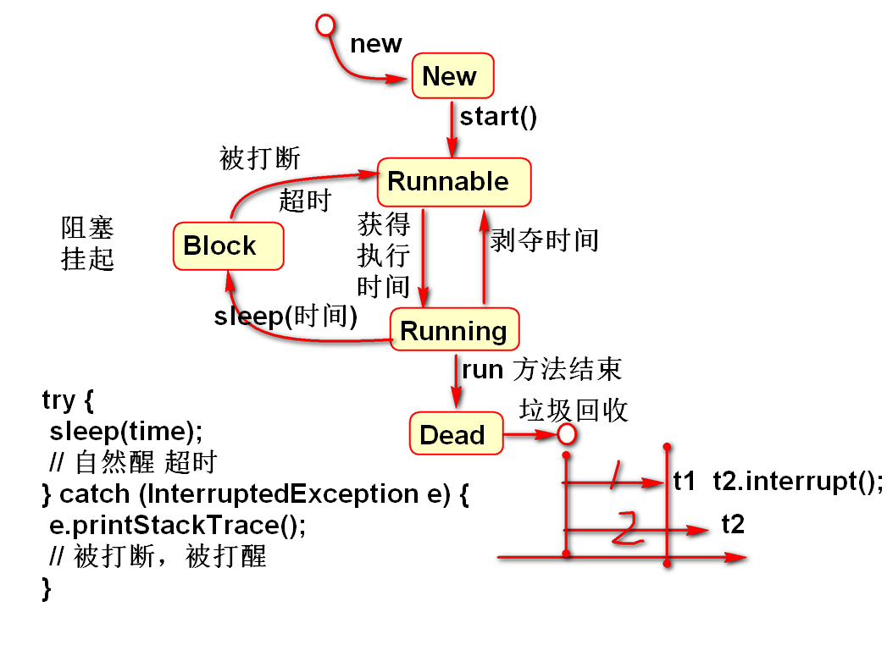
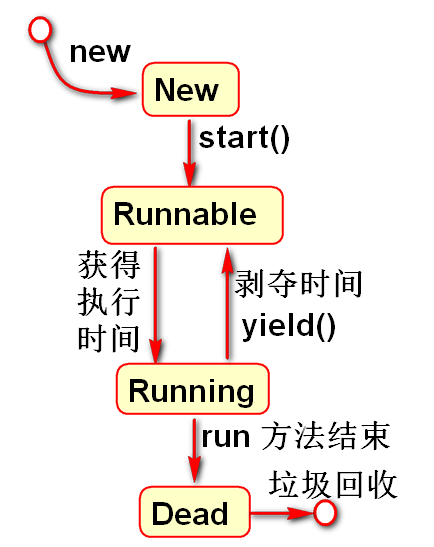

# 线程 

## Thread

1. 继承Thread
2. 重写run方法
3. 创建线程对象，调用start方法

## 使用Runnable 接口创建线程

1. 实现Runnable接口，实现run方法。
2. 创建接口的子类实例。
3. 创建线程对象，将接口的子类实例作为线程参数
4. 调用start方法。启动线程

案例：
	
	class MyRunner implements Runnable{
		public void run(){
			System.out.println("Hello World!");
		}
	}
	//启动线程
	MyRunner runner = new MyRunner();
	Thread t = new Thread(runner);
	t.start();

> 使用Runnable接口创建线程的好处是，当前的类可以继承于其他的类，也可以继承其他的接口。
4、两种方式区别
 [1]查看源码的区别:
 (1)继承Thread : 由于子类重写了Thread类的run(), 当调用start()时, 直接找子类的run()方法
 (2)实现Runnable : 构造函数中传入了Runnable的引用, 成员变量记住了它, start()调用run()方法
 时内部判断成员变量Runnable的引用是否为空, 不为空编译时看的是Runnable的run(),运行时执行的
 是子类的run()方法
 [2]继承Thread
 好处是:可以直接使用Thread类中的方法,代码简单
 弊端是:如果已经有了父类,就不能用这种方法
 [3]实现Runnable接口
好处是:即使自己定义的线程类有了父类也没关系,因为有了父类也可以实现接口,而且接口是可以多实现的
弊端是:不能直接使用Thread中的方法需要先获取到线程对象后,才能得到Thread的方法,代码复杂
-----------------------------------
JAVA 多线程同一个方法 java多线程并行执行
https://blog.51cto.com/love51/6483130

## 线程的状态

- New 新建状态：使用new运算创建的线程对象，是线程的初始状态。
- Runnable: 可运行态，也称就绪状态，线程已经交给操作系统，又操作系统负责调用，等待何时的时机准备运行。
- Running：正在运行状态，操作系统分配时间片段给线程，线程被调度到cpu内执行，单核系统中，只有一个线程处在Running状态。
- Dead：死亡状态，线程结束了run方法的执行，线程结束了使命，线程将被垃圾回收，死亡线程不能再次被启动执行！

案例：输出线程的状态

	Thread t1 = new Thread(){
		public void run(){
			System.out.println("Hello!");
			//输出正在运行状态的线程状态信息
			System.out.println(getState());
			System.out.println(isAlive()); 
		}
	};
	//输出新建状态的线程状态信息
	System.out.println(t1.getState());
	System.out.println(t1.isAlive()); 
	t1.start();
	/**
	 * 等待1秒，目的是等待线程t1一定已经结束
	 * run方法的执行，进入到死亡状态！
	 */
	Thread.sleep(1000); 
	//输出死亡状态的线程状态信息
	System.out.println(t1.getState());
	System.out.println(t1.isAlive());	

## 线程优先级

- 默认是5级
- 最高10级
- 最低1级
- 优先级高的线程，获得CPU时间片段多，执行(代码任务)机会多，但是在计算资源丰富的情况下，运算结果不明显

案例：

	DemoThread t1 = new DemoThread();
	System.out.println(t1.getPriority());//5
	t1.str="A";
	t1.setPriority(1);

	DemoThread t2 = new DemoThread();
	t2.str = "B";

	DemoThread t3 = new DemoThread();
	t3.str = "C";
	t3.setPriority(10); 
	
	t1.start();
	t2.start();
	t3.start();

## 后台线程

当全部前台线程都结束时候， 如果后台线程还没有结束，这时候后台线程将被结束！

> 后台线程可以用于后台背景音乐播放控制。

- 使用setDaemon(true) 将线程设置为后台线程
- setDaemon 一定在线程启动之前调用, 

案例：

	public class Demo06 {
		public static void main(String[] args) {
			TestThread t1 = new TestThread();
			t1.setName("T1"); 
			t1.time = 3000;
			
			TestThread t2 = new TestThread();
			t2.setName("T2"); 
			t2.time = 5000;
			
			TestThread tx = new TestThread();
			tx.setName("TX"); 
			tx.time = 10000;
			//将tx设置为后台(精灵、守护)线程
			// setDaemon 一定在线程启动之前调用
			tx.setDaemon(true);
			
			/**
			 * 当全部前台线程都结束时候， 如果后台
			 * 线程还没有结束，这时候后台线程将被结束！
			 */
			
			t1.start();
			t2.start();
			tx.start();
			
			System.out.println("Bye!"); 
		}
	}
	class TestThread extends Thread{
		int time;
		public void run() {
			System.out.println(getName()+" Start!");
			try {
				sleep(time);
			} catch (InterruptedException e) {
				e.printStackTrace();
			}
			System.out.println(getName()+" End!");
		}
	}

## sleep

- 用于使程序进行适当的休眠
- 唤醒机制，用于两个线程之间进行协调工作。
- 一个线程可以调用另外一个线程的 other.interrupt() 打断线程的休眠
- 被打断的线程 或抛出 InterruptedException 异常

> 在进入sleep block 时候，线程不占用处理器。操作系统可以调度其他线程在处理器中执行。可以充分使用处理器资源

案例

	public class Demo07 {
		public static void main(String[] args) {
			SleepThread t1 = new SleepThread();
			SleepThread t2 = new SleepThread();
			t1.time = 1000;
			t2.time = 2000;
			
			t1.other = t2;	
			
			t1.start();
			t2.start();
		}
	}
	class SleepThread extends Thread{
		int time;
		SleepThread other;
		public void run() {
			System.out.println(getName()+" 开始");
			try {
				sleep(time);
				System.out.println(
					getName()+":大梦谁先醒！");
				// 在t1 中叫醒 t2
				other.interrupt();
			} catch (InterruptedException e) {
				e.printStackTrace();
				System.out.println(
					getName()+":吵醒不高兴！");
			}
			System.out.println(getName()+" 结束");
		}
	}

## yield 让出方法

- 线程让出当前占用的处理器，返回Runnable状态

案例：

	public class Demo08 {
		public static void main(String[] args) {
			Thread3 t1 = new Thread3();
			Thread3 t2 = new Thread3();
			t1.str = "A";
			t2.str = "B";
			t1.start();
			t2.start();
		}
	}
	class Thread3 extends Thread{
		String str;
		public void run() {
			for(int i=0; i<100; i++){
				System.out.println(
					getName() + "->" + str);
				/**
				 * 在运行期间，让出当前线程正在占用的
				 * 处理器资源。
				 */
				yield();
			}
		}
	}

## join 连接两个线程

- 一个线程等到另外一个线程结束再继续运行。
- 等待时候线程进入Block状态
- 等待期间如果被其他线程打断，就抛出中断异常。

案例：一个线程产生10个数据，另外一个线程进行排序

	public class Demo09 {
		public static void main(String[] args) {
			T1 t1 = new T1();
			T2 t2 = new T2();
			List<Integer> list = 
					new ArrayList<Integer>();
			t1.list = list;
			t2.list = list;
			t2.t1 = t1;
			t1.start();
			t2.start();
		}
	}

	class T1 extends Thread{
		List<Integer> list; 
		public void run() {
			for(int i=0; i<10; i++){
				list.add((int)(Math.random()*100));
			}
			//
			System.out.println("T1:"+list); 
		}
	}

	class T2 extends Thread{
		List<Integer> list; 
		T1 t1;
		public void run() {
			try {
				t1.join();//
				//等到了t1线程正常结束
				Collections.sort(list);
				System.out.println("T2:"+list);
			} catch (InterruptedException e) {
				e.printStackTrace();
				// 发生了打断，结束了等待过程
			}
		}
	}

---------------------------------------

# 作业

1. 创建两个线程，分别输出100 Tom 和 Jerry
2. 创建两个线程，一个线程休眠10秒，另外一个线程休眠5秒，休眠5秒的线程在休眠结束以后打断第一个线程的休眠。
3. 创建两个线程，一个线程生产10个1000整数，另外一个线程等到产生10数以后对这10个数进行排序。

# JavaSE进阶-多线程
    多线程相关概念                     【了解】
    多线程的三种实现方式                【重点】
    Thread类的常用方法                 【重点】
    多线程安全问题                     【重点】

##多线程相关概念                     【了解】
什么是多线程
是一种可以让程序同时执行多个任务的技术，可以提供程序的执行效率。

    线程和进程的关系
        进程：正在执行的程序（软件），占用内存和CPU，进程中至少包含一条线程，如果一条都没有则进程也会随之结束
        线程：是进程中的一条执行路径（执行单元）

        单线程：单条执行路径
        多线程：多条执行路径

    并发和并行
        并行：有多个任务同时（同一时刻）执行，多核CPU支持
        并发：有多个任务交替（同一时间段）执行，严格说并非真正的同时执行

        Java中创建的多线程程序是并发执行的

##多线程的三种实现方式                【重点】
方式一：继承Thread类
步骤：
1、自定义一个类继承Thread类
2、重写run方法，run方法就是线程任务所在的方法
public void run(){
}
3、在测试类中，创建自定义类的对象
4、启动线程

                重写的原则：一大两同两小
                    * 重写的时候run方法的声明完成不能改
                    * run方法不能抛异常，如果run方法中有异常，只能try...catch处理

            方式一代码解析：
            1、start方法的作用
                启动线程，并调用run方法
                将run方法中设置的线程任务放到新开启的线程中进行执行
            2、run方法的作用
                用于设置线程任务，线程启动会执行其中的代码
                由于不同的线程执行的任务不同，我们肯定需要对
                父类Thread中的run方法进行重写，对于第一种实现方式来说
                父类Thread中的run方法相当于没有做任务的事情
             3、启动线程调用的是start还是run方法
                调用start方法
                start：启动线程并调用run方法
                run：不会启动线程，只会普通方式在原来的线程中调用run方法

    方式二：实现Runnable接口
            步骤：
                1、自定义一个类实现Runnable接口
                2、重写run方法
                3、在测试类中创建自定义类的对象
                4、创建Thread类的对象，然后将自定义类的对象当做构造方法的参数传递进去
                5、通过Thread类的对象调用start方法启动线程

        方式二代码解析：
            1、为什么多了一个步骤，将实现类对象传递到Thread类对象中？
                自定义类的对象实现的是Runnable接口，没有start方法
                不能直接调用并启动线程，所以要借助Thread类的对象来启动线程，
                而我们的实现类就只做一件事情：设置线程任务

                方式二让线程对象和线程任务分离了

             2、 将线程任务设置到线程对象中，最终是如何执行到线程任务的
                Thread th = new Thread(mt) -> this.target = target;
                th.start() ->th.run() ->if (target != null) { target.run(); }

        创建和启动线程的简化写法
            1、匿名对象方法
                方式一：
                    new MyThread().start();
                方式二：
                    new Thread(new MyThread()).start();
            2、匿名内部类
                方式一：
                     new Thread(){
                        @Override
                        public void run() {
                            // 设置线程任务
                        }
                    }.start();
                方式二：
                    new Thread(new Runnable() {
                        @Override
                        public void run() {
                            // 设置线程任务
                        }
                    }).start();
            3、Lambda表达式
                方式二：
                    new Thread(()->{
                        // 设置线程任务
                    }).start();

    方式三：实现Callable接口
            步骤：
                1、自定义一个类实现Callable接口
                2、重写call方法，作用类似于run方法也是用于设置线程任务的
                    call方法和run方法的两点不同：
                        1、call方法有返回值，而run方法没有返回值
                        2、call方法可以抛异常，而run方法不可以

                3、在测试类中创建自定义类的对象
                4、创建FutureTask的对象，将自定义类对象当做构造方法参数传递进去
                5、创建Thread类的对象，将FutureTask的对象当做构造方法参数传递进去
                6、通过Thread类的对象调用start方法启动线程

    实现线程的三种方式的区别
        1、方式一（继承方式）和另外两种（实现方式）的区别
            方式一：
                好处：继承了之后就是Thread类的子类，可以直接使用Thread类中的方法，编程相对简单
                弊端：扩展性差，Java是单继承的，如果一个类已经继承了其他类，就不能使用这种方式了，
                        另外如果继承Thread类，下次要抽取父类也做不到了
             另外两种：
                好处：扩展性好，Java类在继承的同时可以实现接口，所以如果一个类已经继承了其他类，依然可以
                    使用这种方式，同样的即使实现了接口，也可以抽取父类
                弊端：在这些实现类不能直接使用Thread类中的方法，编程相对复杂

        2、方式三（实现Callable）和另外两种（继承Thread类和实现Runnable接口）的区别
            方式三：
                任务方法是call
                可以返回线程任务执行之后的结果
                支持在处理线程任务的时候抛出异常（throws）

            另外两种：
                 任务方法是run
                 无法得到线程任务执行之后的结果
                 在处理线程任务的时候不能抛出异常

        推荐的实现方式
            方式二
            方式三
            方式一

##Thread类的常用方法                 【重点】
构造方法
Thread(Runnable r)
Thread(String name)
Thread()
Thread(Runnable r, String name)

    成员方法
        void start()
        void run()
        设置和获取线程名称
            获取
                String getName()：获取线程名称

            设置
                线程如果没有设置名称，会有默认名称：
                    普通线程：Thread-x,x从0开始依次递增
                    主线程：主方法所在的线程，默认名称是main

                * void setName(String name) ：设置线程名称
                * 构造方法
                     Thread(String name)
                     Thread(Runnable r, String name)

        static Thread currentThread() ：获取当前正在执行的线程对象
        static void sleep(long millis) ：线程休眠，参数传递的是毫秒值
        设置和获取优先级
            void setPriority(int newPriority)
            int getPriority()
        设置守护线程（用户线程/后台线程）
             void setDaemon(boolean on)：on传递true，就能设置为守护线程          【了解】
             当所有的非守护线程执行完毕，守护线程也会随之结束。

##多线程安全问题                     【重点】
线程安全问题的演示
模拟三个窗口卖100张票，使用多线程实现

        三个窗口：三个线程，线程任务一样的
        演示看到的现象：卖出了重复票和不存在的票

    线程安全问题的原因解析
        重复票：tickets--之前出现的线程CUP被抢夺的情况
        不存在的票：判断之后，卖票之前出现线程CUP被抢夺的情况

        产生问题的通用条件：
            有多线程，操作共享数据，而且操作的共享数据有多条语句。

            如果是单线程不会有线程安全问题
            如果是多线程但是没有操作共享数据，而是操作各自的数据也不会有线程安全问题

    线程安全问题的解决
        方案一：同步代码块
            格式：
                synchronized(锁对象){
                }
                synchronized:关键字，同步
                锁对象：首先是一个对象，而且可以是任意对象，但是多线程看到的该对象必须是同一个

                同步代码块的特点：
                    同一时刻只能有一个线程进入到同步代码块中执行。

                    线程进入到同步代码块之前必须先判断锁是否被其他线程获取，如果被获取了，只能在同步代码块之外等待
                    如果没有被获取，则当前线程获取锁，接下来才能进入到同步代码块中执行，执行完之后，才会归还锁，
                    其他线程才可以继续抢夺锁
        方案二：同步方法
            同步方法：使用synchronized关键字修饰的方法

            非静态同步方法
                修饰符 synchronized 返回值类型 方法名(参数列表){
                    方法体;
                }

            静态同步方法
                修饰符 static synchronized 返回值类型 方法名(参数列表){
                    方法体;
                }

                方法大括号中的方法体内容都是被同步（被锁）的代码
            面试题：
                非静态同步方法和静态同步方法的锁分别是什么？
                非静态同步方法：this
                静态同步方法：当前类的字节码对象  类名.class
        方案三：Lock锁
            三个步骤：
                1、创建锁
                2、锁定
                3、解锁

代码块
Java中只有四种代码块（局部代码块、构造代码块、静态代码块和同步代码块）
代码块：使用一对大括号包裹起来的代码区域

    局部代码块
        格式：
            {
            }
        位置：
            在方法中
        作用：控制变量的作用域，或者节省一点点内存
        特点：变量只能在局部代码块中使用，出了局部代码块则无法使用

    构造代码块
        格式：
            {
            }
        位置：
            类中方法外
        作用：用于抽取所有构造方法前面的重复代码
        特点：每执行一次构造方法都会执行一次构造代码块
            而且先于构造方法执行

    静态代码块
        格式：
            static{
            }
        位置：
            类中方法外
        作用：
            一切一次性的操作，并且要非常早的操作（准备操作）都可以放到静态代码块中执行
            比如：
                jdbc注册驱动
                加载配置文件
        特点：
            1、执行时机非常早，比当前类的主方法还早，随着类的加载而执行
            2、一个类只会加载一次，所以静态代码块只会执行一次

    面试题：分析以下代码的执行结果？