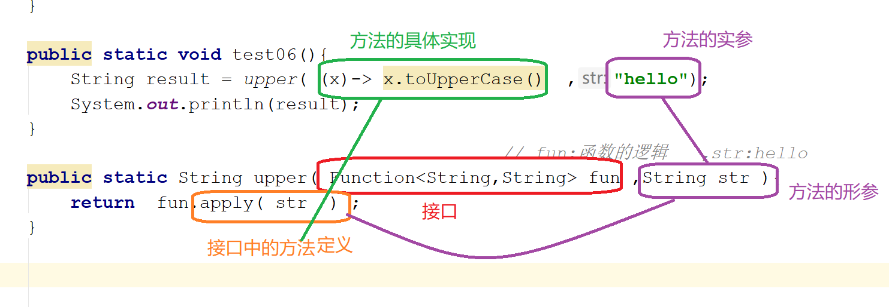

# lambda :简化代码

## lambda   *λ*   组成：
- 逗号隔开的参数列表   (x,x,x)     ()  
- 箭头符号   ->  
- 方法体 （λ代码块）  

——示例:  

        java   
        package lambda;  
        /*  
         * Created by 颜群  
        */  
    public class Demo01 {  
        public static void test01(){  
            new Thread(new Runnable() {//完成形式--匿名块形式  
                @Override  
                public void run() {  
                    System.out.println("run....");
                }
            }).start(); 
        }
        public static void test02(){
            new Thread(
    //           ()  -> { System.out.println("run....");  }//lambda完整形式
                 ()  ->  System.out.println("run....")//lambda简化形式
            ).start();
        }
        public static void main(String[] args) {
    //        test01() ;
              test02() ;
        }
    }

    java
        new Thread(
                ()  ->  System.out.println("run....")
        ).start();

以上述为例，new Thread()中是一个接口、抽象类。_但是为了避免不能区分lambda到底是重写的哪个方法，
语法上lambda要求重写的**接口、抽象类**中有且只能有一个抽象方法_。  

仔细观察，lambda重写的*接口、抽象类*中 会标识一个@FunctionalInterface，称为**函数式接口**。  

>函数式接口：标注@FunctionalInterface，有且只有一个 抽象方法。  

1. **lambda表达式重写的必须是函数式接口(或者只有一个抽象方法的抽象类)**  

>函数式接口要注意以下几点：
2. _即使没有标注@FunctionalInterface，但是只有一个抽象方法，也称之为函数式接口_  
3. 特殊情况：如果某个接口中有多个抽象方法，但**只有1个抽象方法是本接口新定义的**，其他抽象方法和Object中已有的方法重复，
那么该接口仍然是函数式接口。  

 
    java
    package lambda;
    /*
     * Created by 颜群
    */
    @FunctionalInterface
    public interface MyInterface  {//everything is an Object
        public abstract void a() ;//本接口新定义的抽象
        public abstract String toString() ;//和Object中重名(实际会调用Object中的toString())
        public abstract boolean equals(Object obj) ;//和Object中重名
        //重点：toString()和equals()看似是抽象方法，实则是 有方法体的具体方法
    }
    class MyInterfaceImpl implements  MyInterface{
        @Override
        public void a() {
            System.out.println("a...");
        }
    }
    class TestMyInterface{
        public static void main(String[] args) {
            MyInterfaceImpl impl = new MyInterfaceImpl();
            impl.a();
            impl.equals("");
            impl.toString();
        }
    }

MyInterface中的a()方法是 **自己定义的**，而其他equals()、toString()方法可以理解为从Object中继承而来，
因此 MyInterface虽然显示了3个抽象，但其实只有1个抽象。  
`()  { return }`

# 函数式接口：_**JDK8新增的函数式编程**_
>函数式接口从哪来？  

## JDK自带 (很多存在于**java.util.function**包中,_由此提供"函数式编程"功能！_)

###四大核心函数式接口：

- 有参，无返回值  （消费型）  
  `java
  @FunctionalInterface
  public interface Consumer<T> {
      void accept(T t);
      ...
  }
  `

- 无参，有返回值（供给型）  
  `java
    @FunctionalInterface
    public interface Supplier<T> {
      T get();
}
  `

- 有参，有返回值  (函数型)  
`java
  @FunctionalInterface
  public interface Function<T, R> {
      R apply(T t);
      ...
  }
  `

- 断言式接口  
`java 
  @FunctionalInterface
  public interface Predicate<T> {
      boolean test(T t);
      ...
  }
`
- 除了上述4种JDK8自带的函数式接口可直接用，**还可以自定义**！！！
  - 如何使用(如下)

## lambda表达式的使用方式

### 方式一
    函数式接口  引用名 =  lambda表达式;
    Predicate<Integer> p = num -> num < 10;

`java
    public static void test01() {
        //   boolean test(T t);
        Predicate<Integer> p = (num) ->  {return num < 10;} ;
        //Predicate<Integer> p = num ->  num < 10  ;
        System.out.println( p.test(3));
    }
`

`java
    public static void test02(){
        //相当于将 MyMath中的add()方法进行了具体的实现
//        MyMath math =  (int n1,int n2) -> {  return  n1+n2 ;} ;
        MyMath math =  (n1,n2) -> {  return  n1+n2 ;} ;
        System.out.println(   math.add(1,100  )       );
    }
`

### 示例：
`
    package lambda;
    import java.util.function.Consumer;
    import java.util.function.Function;
    import java.util.function.Predicate;
    import java.util.function.Supplier;
    /*
     * Created by 颜群
     */
    public class Demo02 {
        public static void test01(){
            //   boolean test(T t);
    //        Predicate<Integer> p = (num) ->  {return num < 10;} ;
            Predicate<Integer> p = num ->  num < 10  ;
            System.out.println( p.test( 3  )   );
        }
        public static void test02(){
            //相当于将 MyMath中的add()方法进行了具体的实现
    //        MyMath math =  (int n1,int n2) -> {  return  n1+n2 ;} ;
             //lambda自带类型推断机制，因此参数的类型 可以省略
            MyMath math =  ( n1,n2) ->     n1+n2  ;
            System.out.println(   math.add(1,100  )       );
        }
        public static void test03(){
            // void accept(T t);
            Consumer<String> c = (x) ->  System.out.println("吃："+x) ;
            c.accept("苹果");
        }
        public static void test04(){
            Supplier<Integer> supplier = ()->  (int)(Math.random()*9000+1000) ;
            System.out.println(   supplier.get() );
        }
        public static void test05(){
            Function<String,String> f = (s) -> s.toUpperCase() ;
            System.out.println(  f.apply("hello world"));
        }
            public static void main(String[] args) {
            test05();
        }
    }
`

### 方式二
`
    new Thread(()  ->  System.out.println("run....")).start(); ;
`

将lambda表达式所代表的函数式接口(内置的+自定义的！)，作为一个方法的参数存在。——**"高阶函数的一种特殊形式"**  
理解：方法B( 方法A(就是一个lambda实现) )：函数式编程。scala  javascript本身就支持函数式编程。  
形式：(编写定义时)方法(函数式接口)  

`
package lambda;  
import java.util.function.Consumer;  
import java.util.function.Function;  
import java.util.function.Predicate;  
import java.util.function.Supplier;  
    /*
     * Created by 颜群
     */
    public class Demo02 {
        public static void test01(){
            //   boolean test(T t);
    //        Predicate<Integer> p = (num) ->  {return num < 10;} ;
            Predicate<Integer> p = num ->  num < 10  ;
            System.out.println( p.test( 3  )   );
        }
    public static void test02(){
        //相当于将 MyMath中的add()方法进行了具体的实现
//        MyMath math =  (int n1,int n2) -> {  return  n1+n2 ;} ;
        MyMath math =  (n1,n2) ->     n1+n2  ;
        System.out.println(   math.add(1,100  )       );
    }
    public static void test03(){
        // void accept(T t);
        Consumer<String> c = (x) ->  System.out.println("吃："+x) ;
        c.accept("苹果");
    }
    public static void test04(){
        Supplier<Integer> supplier = ()->  (int)(Math.random()*9000+1000) ;
        System.out.println(   supplier.get() );
    }
    public static void test05(){
        Function<String,String> f = (s) -> s.toUpperCase() ;
        System.out.println(  f.apply("hello world"));
    }
    public static void test06(){
        String result = upper( (x)-> x.toUpperCase()  ,"hello");
        System.out.println(result);
    }
                                                // fun:函数的逻辑   ,str:hello
    public static String upper( Function<String,String> fun ,String str ) {
        return  fun.apply( str  ) ;
    }
    public static void test07() {
        myPredicate( (x) -> x>18   ,  10);
    }
    public static void myPredicate(Predicate<Integer> pre,  Integer num   ) {
        System.out.println(   pre.test( num ) );
    }
        public static void main(String[] args) {
        test07();
    }
}
`

# 总结：
- 函数式接口(方法) 由 lambda形式实现！
- 函数式接口(的lambda实现)可以作为方法的参数

# Java方法引用：提高代码可读性和可维护性
##前言
>在Java 8中，可以使用方法引用（Method Reference）来简化Lambda表达式。方法引用是一种更简洁易懂的语法形式，
可以通过指定方法的名称代替Lambda表达式。  

本文将介绍方法引用的用法和实现原理，并结合代码案例详细讲解。

##方法引用的介绍
方法引用是Java 8中的新特性，它允许**直接引用已有 Java 类或对象的方法**，并传递它们作为 Lambda 表达式的参数。

方法引用的语法为：对象名::方法名 或 类名::静态方法名。

>下面是一个简单的例子：  
`
List<String> list = new ArrayList<>();
list.add("apple");
list.add("banana");
list.forEach(System.out::println);
`
上述代码中，list.forEach(System.out::println)使用了方法引用语法，打印了列表中的每个元素。

##方法引用的用法
方法引用可以分为四种类型：

###对象::实例方法
这种方法引用使用一个实例对象来调用方法，语法为：对象名::方法名。

>下面是一个例子：
`
List<Integer> list = Arrays.asList(1, 2, 3);
list.forEach(System.out::println);
`
上述代码中，System.out::println表示对输出流 System.out 调用方法 println。它等同于 Lambda 表达式 (x) -> System.out.println(x)。

###类::静态方法
这种方法引用使用一个类来调用它的静态方法，语法为：类名::静态方法名。

>下面是一个例子：
`
List<Integer> list = Arrays.asList(1, 2, 3);
Collections.sort(list, Integer::compareTo);
`
上述代码中，Integer::compareTo 表示对 Integer 类调用 compareTo 方法。它等同于 Lambda 表达式 (x, y) -> Integer.compare(x, y)。

###类::实例方法
这种方法引用使用一个 Class 的实例来调用它的实例方法，语法为：类名::方法名。

>下面是一个例子：
`
String str = "hello world";
Function<Integer, Character> fun = str::charAt;
`
上述代码中，str::charAt 表示对字符串对象 str 调用 charAt 方法。它等同于 Lambda 表达式 (x) -> str.charAt(x)。

###构造函数引用
这种方法引用使用构造函数来创建新的对象实例，语法为：类名::new。

>下面是一个例子：
`
Supplier<List<String>> supplier = ArrayList::new;
`
上述代码中，ArrayList::new 表示使用 ArrayList 的无参构造函数来创建供应商（Supplier），它等同于 Lambda 表达式 () -> new ArrayList<>()。

##方法引用的实现原理
方法引用的实现原理就是调用关键方法 java.util.function.MethodHandles.lookup() ，它可以获得一个 MethodHandles.Lookup 对象，该对象可以通过 findVirtual、findStatic、findConstructor 等方法来查找类中的方法。

>下面是一个例子：
`
MethodHandle handle = MethodHandles.lookup().findVirtual(String.class, "length", MethodType.methodType(int.class));
`
上述代码中，MethodHandles.lookup().findVirtual 表示在 String 类中查找名为 length 的实例方法，并返回一个 MethodHandle 对象。

在 Java 8 中，**方法引用被实现为 Lambda 表达式的语法糖**，_即当一个 Lambda 表达式只调用一个已经存在的方法时_，就可以简化成方法引用的形式，从而提高代码的可读性和可维护性。

###总结
本文介绍了Java方法引用的用法和实现原理，相信对于初学者来说有所帮助。Java方法引用可以简化代码，提高代码可读性和可维护性，适用于大多数情况。在实际开发中，根据场景选择合适的方法引用类型，能够使代码变得更加高效，易于维护。
