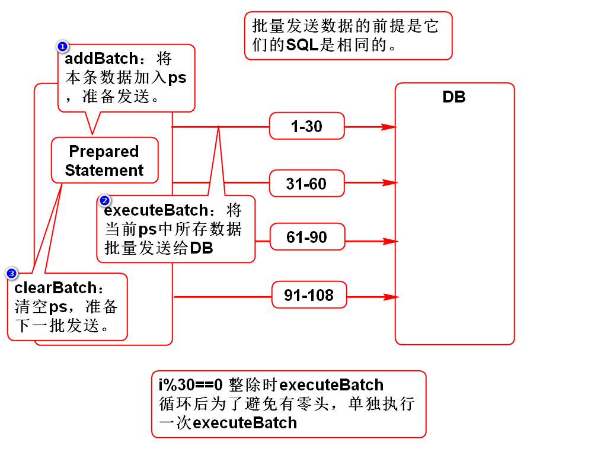
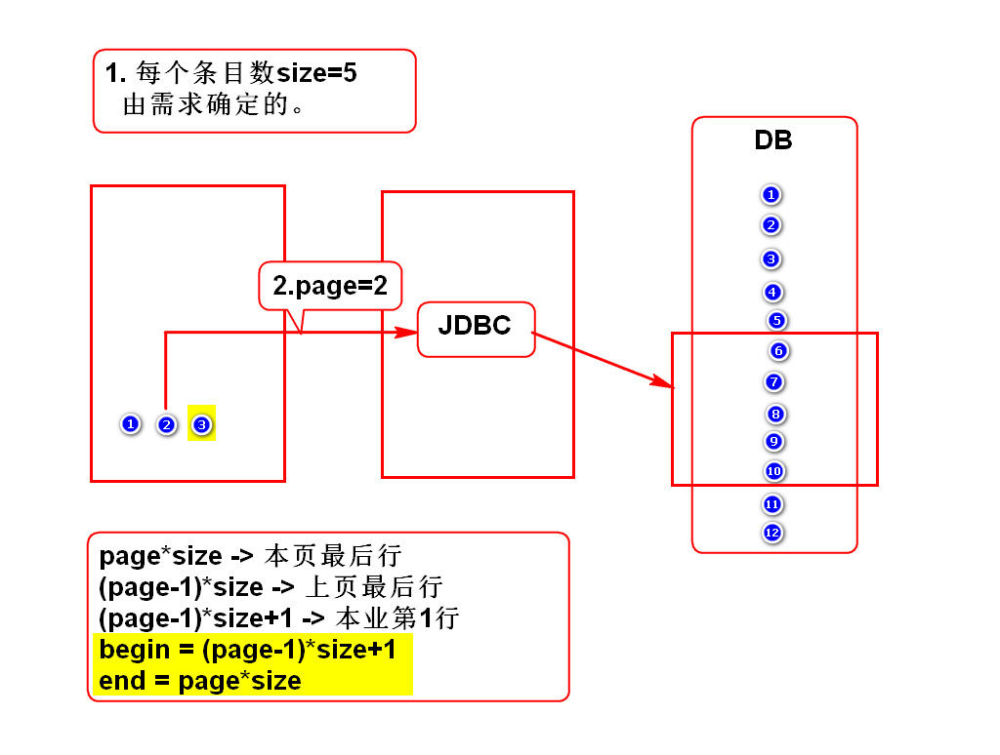
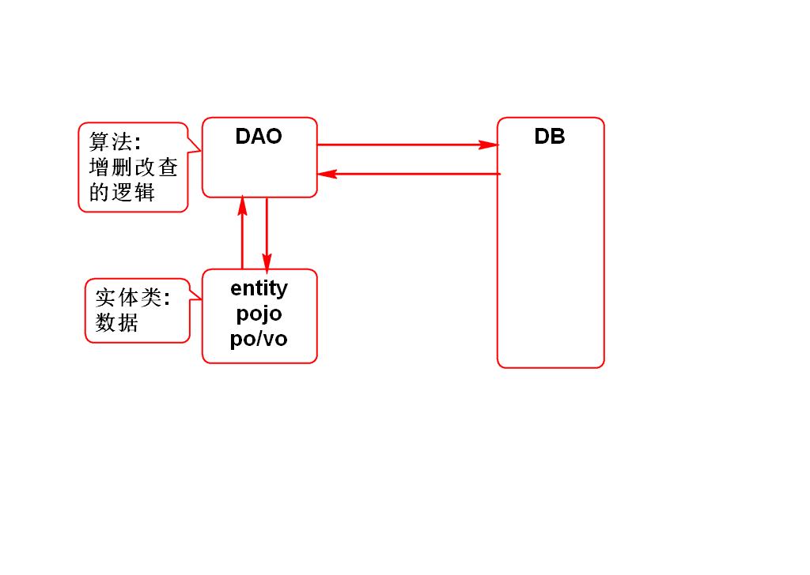
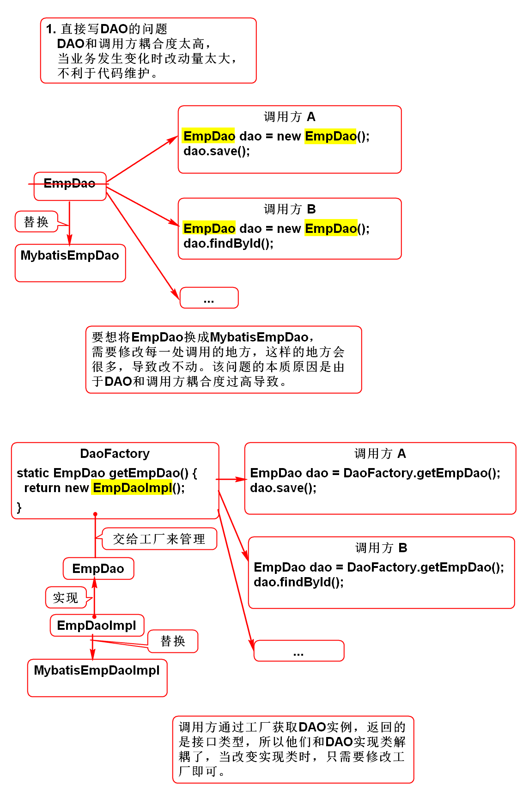

# 批量添加数据

# 获取自动生成的ID
！

# JDBC对分页的支持
## 假分页(内存分页)
- 首次查询时查出所有数据，存入List，并从List中取出第1页数据返回；
- 再次查询时，不再访问数据库，而是直接从List中取出第N页数据返回；
- 特点：十分占内存，首次查询巨慢，以后查询很快；
- 适用于数据量非常小的小项目；

## 真分页(物理分页)
- 每次查询都使用分页SQL从库中查出1页的数据返回；
- 特点：节约内存，每次查询的速度都较快；
- 适用于任何项目；

## Oracle分页SQL
	
	select * from (
		select e.*,rownum r from (
			select * from emps order by empno
		) e
	) where r between 21 and 30

## MySql分页SQL

	select * from emps
	order by emps
	limit 21,10

## 分页条件计算公式

# DAO

# DAO的工厂和接口

# 补充JavaBean
## 满足如下规范的类
1. 有package
2. 有默认构造器
3. 实现序列化接口
4. 有get/set方法

