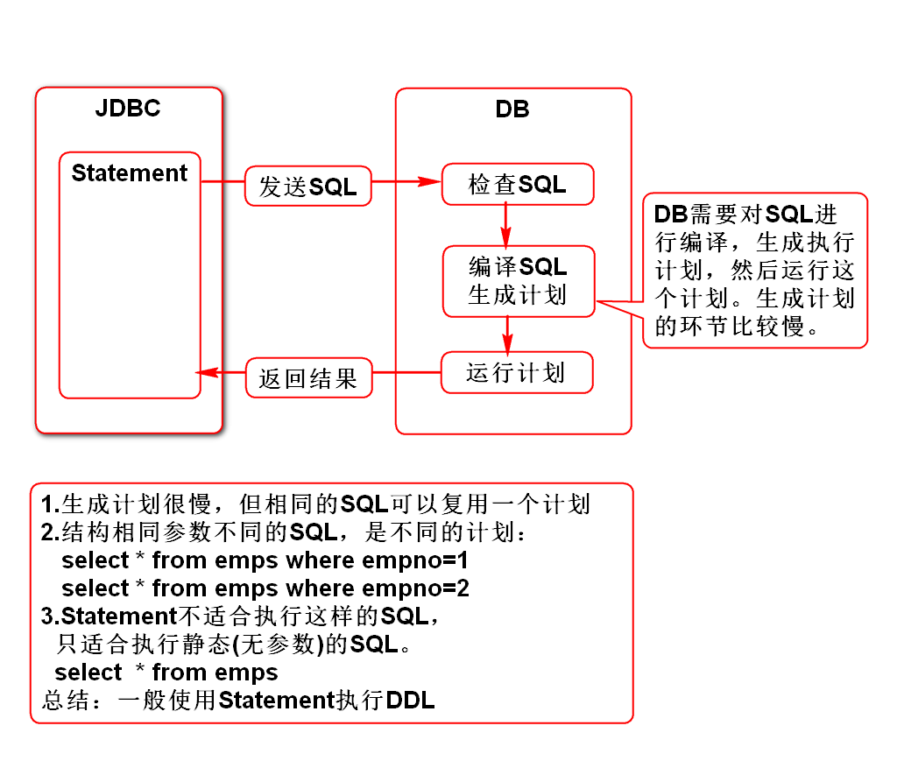
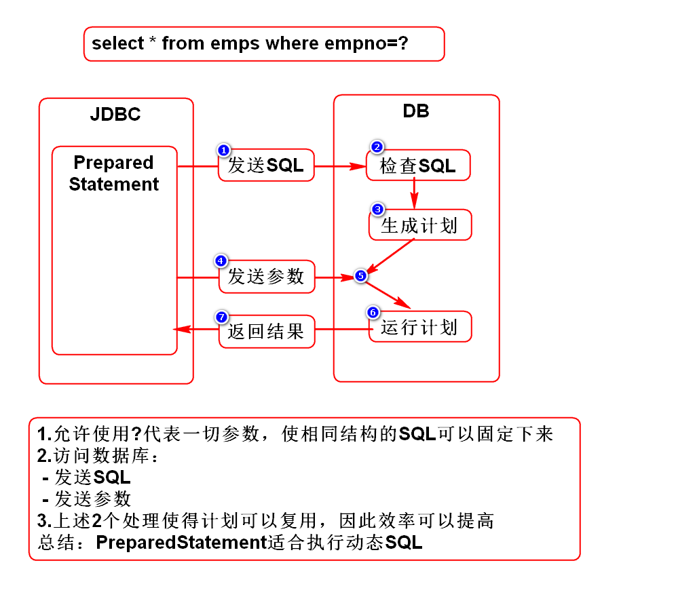
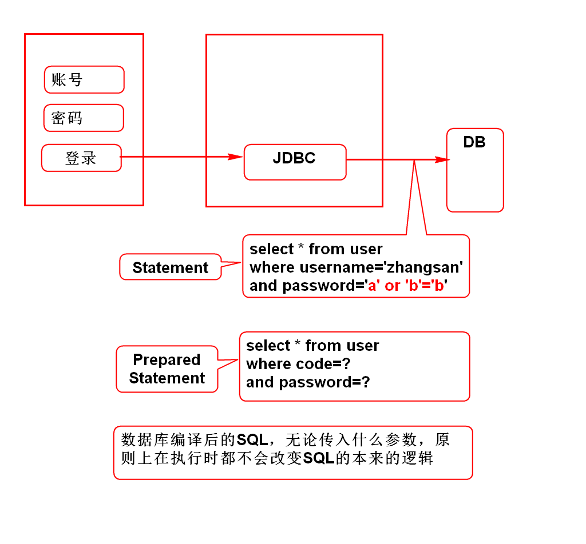
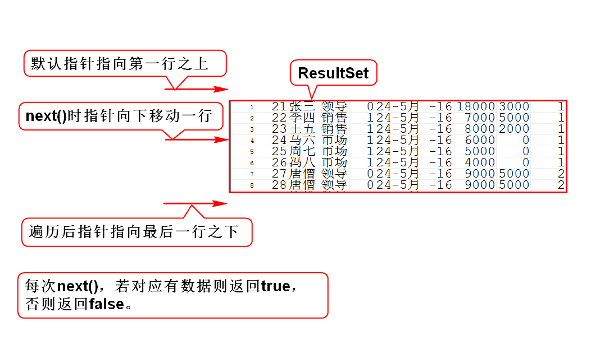

# Statement

# PreparedStatement

# JDBC支持的日期类型
## JDBC支持3个日期类型
1. java.sql.Date(年月日)
2. java.sql.Time(时分秒)
3. java.sql.Timestamp(年月日时分秒)

## 上述3个日期类型都继承于java.util.Date

# 注入攻击

# 结果集

# 结果集元数据
## 元(Meta)
- 本来、根本、本质

## 元数据(MetaData)
- 数据的本质
- 数据的基本信息
- 用来描述某数据的数据

## 结果集元数据(ResuleSetMetaData)
- 用来描述结果集的数据
- 结果集的基本信息
- 多少列/列名/类型

# JDBC对事务的支持
## 1.自动提交(默认)
- JDBC默认支持事务。
- 执行executeUpdate()时，JDBC会自动commit。

## 2.手动提交
- con.setAutoCommit(false);//取消自动提交
- con.commit();//手动提交事务
- con.rollback();//回滚事务

# 事务
## 什么是事务
### 满足如下特性的数据库访问叫事务：
1. 原子性：事务是一个完整的过程，要么都成功，要么都失败。
2. 一致性：事务前后的数据要一致，即收支平衡(总和不变)。
3. 隔离性：事务过程中的数据不能被访问。
4. 持久性：事务一旦达成，就永久有效，不能否认。

