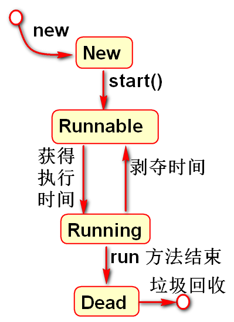
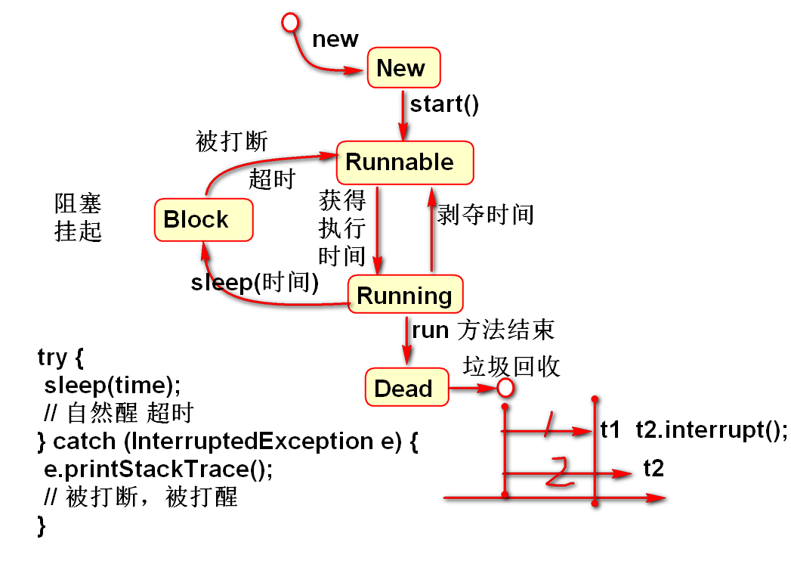
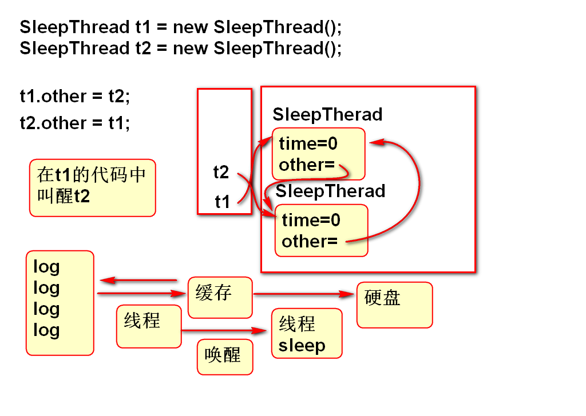
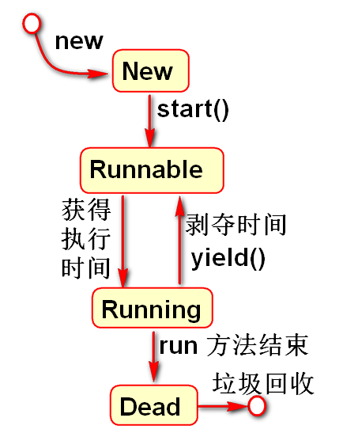
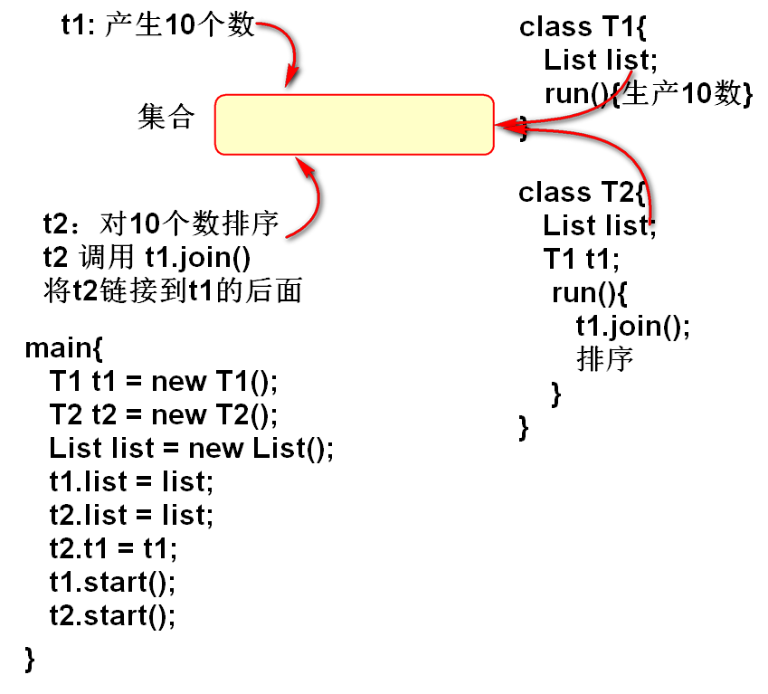

# 线程 

## Thread

1. 继承Thread
2. 重写run方法
3. 创建线程对象，调用start方法

## 使用Runnable 接口创建线程

1. 实现Runnable接口，实现run方法。
2. 创建接口的子类实例。
3. 创建线程对象，将接口的子类实例作为线程参数
4. 调用start方法。启动线程

案例：
	
	class MyRunner implements Runnable{
		public void run(){
			System.out.println("Hello World!");
		}
	}
	//启动线程
	MyRunner runner = new MyRunner();
	Thread t = new Thread(runner);
	t.start();

> 使用Runnable接口创建线程的好处是，当前的类可以继承于其他的类，也可以继承其他的接口。

## 线程的状态

- New 新建状态：使用new运算创建的线程对象，是线程的初始状态。
- Runnable: 可运行态，也称就绪状态，线程已经交给操作系统，又操作系统负责调用，等待何时的时机准备运行。
- Running：正在运行状态，操作系统分配时间片段给线程，线程被调度到cpu内执行，单核系统中，只有一个线程处在Running状态。
- Dead：死亡状态，线程结束了run方法的执行，线程结束了使命，线程将被垃圾回收，死亡线程不能再次被启动执行！

案例：输出线程的状态

	Thread t1 = new Thread(){
		public void run(){
			System.out.println("Hello!");
			//输出正在运行状态的线程状态信息
			System.out.println(getState());
			System.out.println(isAlive()); 
		}
	};
	//输出新建状态的线程状态信息
	System.out.println(t1.getState());
	System.out.println(t1.isAlive()); 
	t1.start();
	/**
	 * 等待1秒，目的是等待线程t1一定已经结束
	 * run方法的执行，进入到死亡状态！
	 */
	Thread.sleep(1000); 
	//输出死亡状态的线程状态信息
	System.out.println(t1.getState());
	System.out.println(t1.isAlive());	

## 线程优先级

- 默认是5级
- 最高10级
- 最低1级
- 优先级高的线程，获得CPU时间片段多，执行(代码任务)机会多，但是在计算资源丰富的情况下，运算结果不明显

案例：

	DemoThread t1 = new DemoThread();
	System.out.println(t1.getPriority());//5
	t1.str="A";
	t1.setPriority(1);

	DemoThread t2 = new DemoThread();
	t2.str = "B";

	DemoThread t3 = new DemoThread();
	t3.str = "C";
	t3.setPriority(10); 
	
	t1.start();
	t2.start();
	t3.start();

## 后台线程

当全部前台线程都结束时候， 如果后台线程还没有结束，这时候后台线程将被结束！

> 后台线程可以用于后台背景音乐播放控制。

- 使用setDaemon(true) 将线程设置为后台线程
- setDaemon 一定在线程启动之前调用, 

案例：

	public class Demo06 {
		public static void main(String[] args) {
			TestThread t1 = new TestThread();
			t1.setName("T1"); 
			t1.time = 3000;
			
			TestThread t2 = new TestThread();
			t2.setName("T2"); 
			t2.time = 5000;
			
			TestThread tx = new TestThread();
			tx.setName("TX"); 
			tx.time = 10000;
			//将tx设置为后台(精灵、守护)线程
			// setDaemon 一定在线程启动之前调用
			tx.setDaemon(true);
			
			/**
			 * 当全部前台线程都结束时候， 如果后台
			 * 线程还没有结束，这时候后台线程将被结束！
			 */
			
			t1.start();
			t2.start();
			tx.start();
			
			System.out.println("Bye!"); 
		}
	}
	class TestThread extends Thread{
		int time;
		public void run() {
			System.out.println(getName()+" Start!");
			try {
				sleep(time);
			} catch (InterruptedException e) {
				e.printStackTrace();
			}
			System.out.println(getName()+" End!");
		}
	}

## sleep

- 用于使程序进行适当的休眠
- 唤醒机制，用于两个线程之间进行协调工作。
- 一个线程可以调用另外一个线程的 other.interrupt() 打断线程的休眠
- 被打断的线程 或抛出 InterruptedException 异常

> 在进入sleep block 时候，线程不占用处理器。操作系统可以调度其他线程在处理器中执行。可以充分使用处理器资源

案例

	public class Demo07 {
		public static void main(String[] args) {
			SleepThread t1 = new SleepThread();
			SleepThread t2 = new SleepThread();
			t1.time = 1000;
			t2.time = 2000;
			
			t1.other = t2;	
			
			t1.start();
			t2.start();
		}
	}
	class SleepThread extends Thread{
		int time;
		SleepThread other;
		public void run() {
			System.out.println(getName()+" 开始");
			try {
				sleep(time);
				System.out.println(
					getName()+":大梦谁先醒！");
				// 在t1 中叫醒 t2
				other.interrupt();
			} catch (InterruptedException e) {
				e.printStackTrace();
				System.out.println(
					getName()+":吵醒不高兴！");
			}
			System.out.println(getName()+" 结束");
		}
	}

## yield 让出方法

- 线程让出当前占用的处理器，返回Runnable状态

案例：

	public class Demo08 {
		public static void main(String[] args) {
			Thread3 t1 = new Thread3();
			Thread3 t2 = new Thread3();
			t1.str = "A";
			t2.str = "B";
			t1.start();
			t2.start();
		}
	}
	class Thread3 extends Thread{
		String str;
		public void run() {
			for(int i=0; i<100; i++){
				System.out.println(
					getName() + "->" + str);
				/**
				 * 在运行期间，让出当前线程正在占用的
				 * 处理器资源。
				 */
				yield();
			}
		}
	}

## join 连接两个线程

- 一个线程等到另外一个线程结束再继续运行。
- 等待时候线程进入Block状态
- 等待期间如果被其他线程打断，就抛出中断异常。

案例：一个线程产生10个数据，另外一个线程进行排序

	public class Demo09 {
		public static void main(String[] args) {
			T1 t1 = new T1();
			T2 t2 = new T2();
			List<Integer> list = 
					new ArrayList<Integer>();
			t1.list = list;
			t2.list = list;
			t2.t1 = t1;
			t1.start();
			t2.start();
		}
	}

	class T1 extends Thread{
		List<Integer> list; 
		public void run() {
			for(int i=0; i<10; i++){
				list.add((int)(Math.random()*100));
			}
			//
			System.out.println("T1:"+list); 
		}
	}

	class T2 extends Thread{
		List<Integer> list; 
		T1 t1;
		public void run() {
			try {
				t1.join();//
				//等到了t1线程正常结束
				Collections.sort(list);
				System.out.println("T2:"+list);
			} catch (InterruptedException e) {
				e.printStackTrace();
				// 发生了打断，结束了等待过程
			}
		}
	}

---------------------------------------

# 作业

1. 创建两个线程，分别输出100 Tom 和 Jerry
2. 创建两个线程，一个线程休眠10秒，另外一个线程休眠5秒，休眠5秒的线程在休眠结束以后打断第一个线程的休眠。
3. 创建两个线程，一个线程生产10个1000整数，另外一个线程等到产生10数以后对这10个数进行排序。

