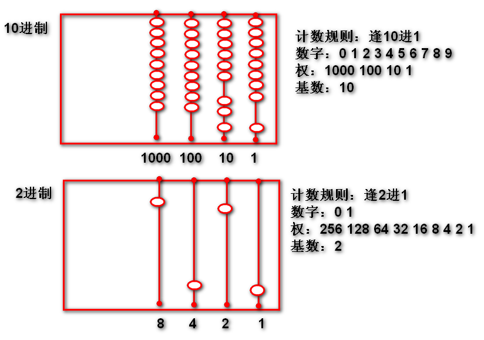
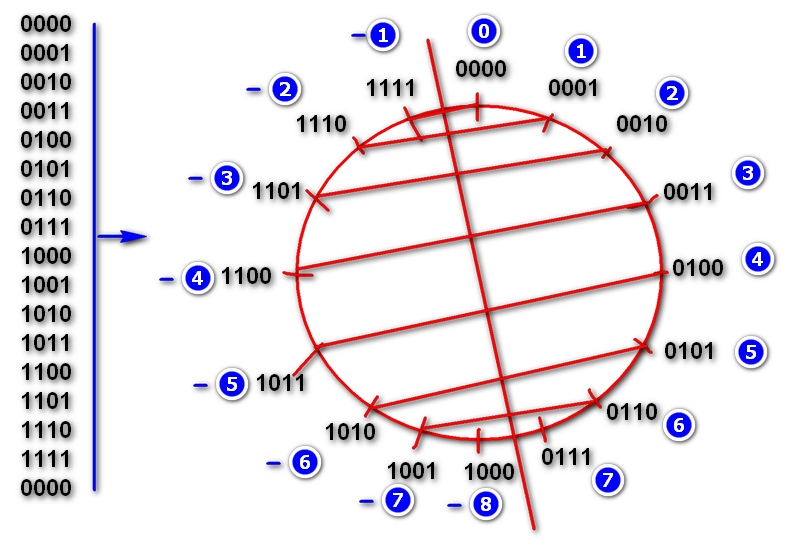

# 二进制

程序=数据结构+算法
计算机内部一切都是2进制

## 什么是2进制

> 回顾10进制：逢10进1的计数规则

定义：逢2进1的计数规则。

> 因为2进制可以进行计数（加法），所有可以支持任何的数学运算！
   

4位2进制数字：
	
	8421(权)
	0000
	0001
	0010
	0011
	0100
	0101
	0110
	0111
	1000
	1001
	1010
	1011
	1100
	1101
	1110
	1111

## 为什么要使用2进制

采用2进制作为计算机的计数规则，可以实现更加低廉的制造成本。

编程语言将自动处理10进制到2进制的转换：

	int i = 56;// Integer.parseInt()
	//Integer.toString()
	System.out.println(i);//56 

> 计算机内部处理是2进制的，编程语言将10进制转换为2进制交给计算机处理，编程语言给使用者留下的错觉：计算机能够直接处理10进制。

## 如何使用2进制

### 2进制与十进制的相互转换

> 因为10进制用于计数，2进制也可以用于计数，转换是指，当表示相同个数时候，10进制的数字和2进制数字是相当的数字。

10进制转换为2进制：

	8(10) = 1000(2)

	8421(权) 
	1101(2) = 8+4+1 = 13(10)
	              128 64 32 16 8 4 2 1(权)
	11011010(2) =  1   1  0  1 1 0 1 0
	            = 128 + 64 + 16 + 8 + 2
	            = 218(10)

2进制转换为10进制：

	          128 64 32 16 8 4 2 1 (权)
	234(10) =   1  1  1  0 1 0 1 0
	          106 42 10 10 2   0
	        = 11101010(2)

Java代码验算：

	int n = 234;
	System.out.println(
		Integer.toBinaryString(n));

### 16进制

> 2进制书写非常长麻烦，不便，使用16进制简写就方便了很多！

16进制是2进制的简写形式！

16进制的一位数，可以对应简写2进制4位数，就可以大大简化2进制的书写！

16进制的计数规则：
	
	逢16进一
	数字：0 1 2 3 4 5 6 7 8 9 a b c d e f 
	权：256 16 1
	基数：16

> 16进制的一位数与2进制的4位数对应的数值相等。
	
2进制与16进制的缩写对照表：

	0000  0
	0001  1
	0010  2
	0011  3
	0100  4
	0101  5
	0110  6
	0111  7
	1000  8
	1001  9
	1010  a
	1011  b
	1100  c
	1101  d
	1110  e
	1111  f

	0100 0001(2) = 41(16)

案例：
	
	//10101110(2) = ?(10)
	//a   e   
	int i=0xae;//0xae 就是 10101110 缩写
	System.out.println(i);

经典题目：
	
	int i=0xae;
	System.out.println(
		Integer.toBinaryString(i));
	如上代码的输出结果：
	A. 编译错误 B.运行异常 C.10101110 
	D. 10111110

### 补码

> 是一种算法，补码是计算机中用来表示负数，使得负数能够使用加法器参与加法运算的一种码。已经被封装为方法了，Integer.toString() Integer.parseInt()

为啥需要使用补码：省钱。

补码的原理

补码特点：

补码的最大值（int）：

	int max = 0x7fffffff;
	System.out.println(
		Integer.toBinaryString(max));

补码的最小值（int）：

	int min = 0x80000000;
	System.out.println(
		Integer.toBinaryString(min));

-1 的补码：
	
	int n = -1;// 1111...32个1
	System.out.println(n);//toString(n) -1
	System.out.println(
		Integer.toBinaryString(n));
	//如何用16进制缩写 -1

经典面试题：

	int n = Integer.MAX_VALUE;
	System.out.println(
		Integer.toBinaryString(n));
	如上代码的输出结果：
	A.11111111111111111111111111111111
	B.1111111111111111111111111111111
	C.10000000000000000000000000000000
	D.01111111111111111111111111111111

溢出的规律：

> 溢出结果不是随机数！

1. 正数溢出结果可能是负数或正数
2. n = (max+1)*2 + n
3. min = max+1

补码的对称现象：-n = ~n + 1 反码=(原码取反 + 1)

经典面试题：

	System.out.println(~8+1);//-8
	如上代码的执行结果：
	A.编译错误 B.运行异常 C.9 D.8 E.-8

	System.out.println(~-8+1);//8
	如上代码的执行结果：
	A.编译错误 B.运行异常 C.9 D.8 E.-8

	System.out.println(~-8);//7
	如上代码的执行结果：
	A.编译错误 B.运行异常 C.7 D.8 E.-8

### 2进制运算

> 按照2进制的每个位进行计算的运算符

~ & | >>> >> <<

#### ~ 取反运算（略）

####  >>> 逻辑右移位运算

规则：将数据的每个位向右移动

举个栗子：

	n:00000000 00000000 00000000 00110010
	m=n>>>1
	m:000000000 00000000 00000000 0011001
	m=n>>>2
	m:0000000000 00000000 00000000 001100

代码：

	int n = 50;//
	int m =n >>> 1;
	System.out.println(
		Integer.toBinaryString(n));
	System.out.println(
		Integer.toBinaryString(m));

#### << 左移位运算

举个栗子：

	n:00000000 00000000 00000000 00110010.
	m=n<<1
	m:0000000 00000000 00000000 001100100.
	m=n<<2
	m:000000 00000000 00000000 0011001000.

代码：

	int n = 50;//
	int m =n << 1;
	System.out.println(
		Integer.toBinaryString(n));
	System.out.println(
		Integer.toBinaryString(m));

#### 移位运算的数学意义

> 引子：
>	移动小数点运算
>	34772  小数点向右移动一次
>	347720  数据X10
>	假设小数点不动，则数字向左移动，数字向左移动一次，原数据X10

如上规则在2进制中依然成立！在2进制中数据向左移动一次，原数据X2

举个栗子：
	
	int n = 50;
	int m = n << 1;
	System.out.println(m);//100
	
经典题目：
	
	如何优化将n*8运算？（答案：n<<3）

#### >> 数学右移位运算

运算规则：
- 当正数情况下，左侧补0；
- 当负数情况下，左侧补1；保存符号不变

举个栗子：
	
	n= 11111111 11111111 11110111 11110100 
	int n = 0xfffff7f4;
	int m1 = n>>>1;
	//m1:011111111 11111111 11110111 1111010
	int m2 = n>>1;
	//m2:111111111 11111111 11110111 1111010
	System.out.println(n);
	System.out.println(m1);
	System.out.println(m2);
	
移位运算的用途：实现int类型的文件读写
	
	RandomAccessFile raf = 
		new RandomAccessFile("demo.dat","rw");
	//将int类型的低8位写到文件里面
	//b:00000000 00000000 00000000 00010000 
	raf.write(0x10);//0x10
	//b:1025 将1025写到文件中
	//b:00000000 00000000 00000100 00000001
	raf.write(0x401);//0x01
	raf.write(0x401>>>8);//0x04
	//     0  1  2  3
	//raf= 10 01 04 EOF
	//           ^
	raf.seek(1);
	//从文件中读取1025
	int b1 = raf.read();//0x01
	int b2 = raf.read();//0x04
	// 1025
	// b1:00000000 00000000 00000000 00000001
	// b2:00000000 00000000 00000000 00000100
	// m :00000000 00000000 00000100 00000001
	int m = b2<<8 + b1;
	System.out.println(m);

RAF提供了方法（算法）封装了整数的读写方法：

	RandomAccessFile raf 
		= new RandomAccessFile(
				"demo.dat", "rw");
	int n = 2182218;
	//writeInt 方法将int n拆分为4个
	//byte连续写到文件中
	raf.writeInt(n);
	//seek 方法将文件的指针位置重新移动到文件 的开头位置
	raf.seek(0);
	//readInt方法从文件中连续读取4个byte并且拼接为一个int数据
	int m = raf.readInt();	
	raf.close();
	System.out.println(m); 
	//writeInt 和 readInt 是一对读写方法，一个是将整数拆分写到文件中
	//一个是从文件读取byte拼接为int

## 作业：编写案例测试如上所有案例，更换数据后再次测试。

