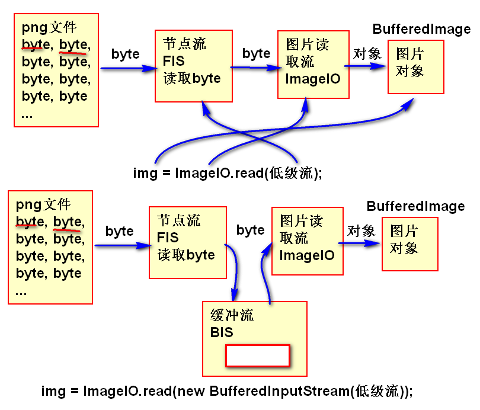
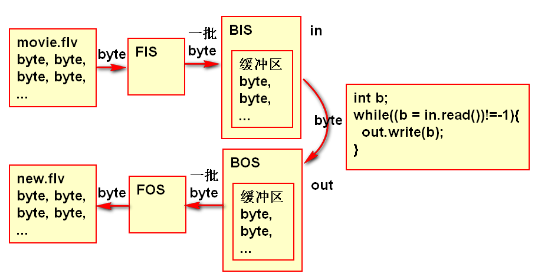
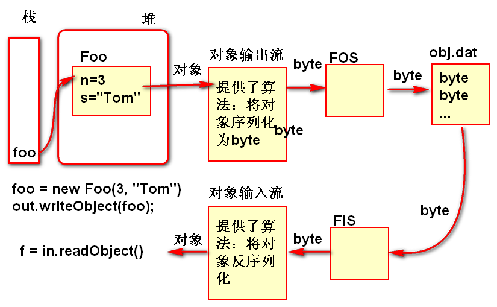
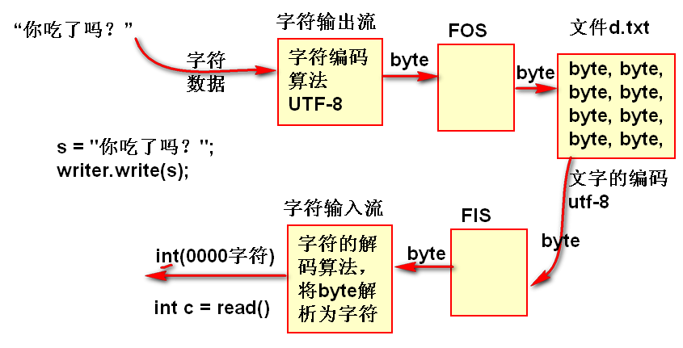
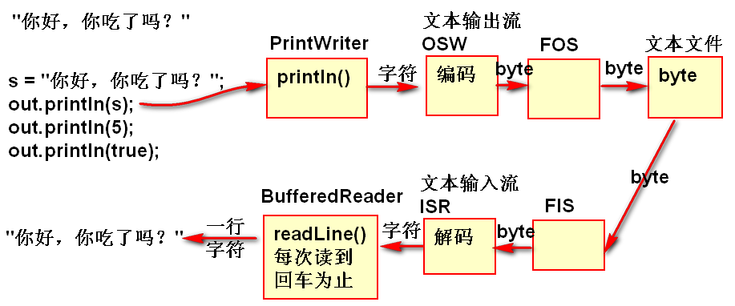

# IO 流

## 节点流

从特定的数据源开始读写数据，只提供最基本的byte读写方法，功能简单。

## 过滤流（处理流，高级流，扩展流）

必须依赖低级流（包含节点流），过滤流不能单独工作，在低级流的基础之上扩展了丰富的数据类型读写功能。功能复杂，使用方便。

## 文件流

文件是节点流，以文件作为数据源读写数据，只提供简单byte读写功能，很少直接使用。

## 缓冲流

过滤流，是高级流，不能单独工作，必须依赖低级流（低级流做为构造器参数）提供了自动化缓冲区管理，使用缓冲流可以提供软件的IO性能。不会改变原有的软件逻辑。在读写文件时候都会加上缓冲流提高性能。

代码：利用缓冲流提高文件复制的性能

	FileInputStream fis = 
		new FileInputStream("moive.flv");
	FileOutputStream fos = 
		new FileOutputStream("new.flv");
	BufferedInputStream in=
		new BufferedInputStream(fis);
	BufferedOutputStream out=
		new BufferedOutputStream(fos);
	int b;
	while((b = in.read())!=-1){
		out.write(b);
	}
	in.close();
	out.close();

原理：

## 对象流

对象流是高级流，不能单独工作，必须依赖低级流（低级流做为构造器参数），对象流提供了对象的序列化和反序列化功能，可以将对象序列化为byte数据，或将byte数据反序列化为对象。

> 对象流要求被序列化的对象必须实现序列化接口，如果不实现序列化接口，在序列化时候会出现运行异常。

### 序列化接口
#### 前言
>为什么要对对象进行序列化？
简单的说序列化就是以某种方式将内存中的Java对象编程二进制字节
既然是字节，那么处理起来就很方便，可以存储起来，也可以存在文件中、或者发送给别人。
Java平台允许我们在内存中创建可复用的Java对象，但一般情况下，只有当JVM处于运行时，这些对象才可能存在，即，这些对象的生命周期不会比JVM的生命周期更长（即每个对象都在JVM中）
但在现实应用中，就可能要停止JVM运行，但有要保存某些指定的对象，并在将来重新读取被保存的对象。这是Java对象序列化就能够实现该功能。（可选择入数据库、或文件的形式保存）
但是有时候，是需要在网络上传输某些对象，如当使用RMI(远程方法调用)，或者分布式间不同主机间可以网络传递等等，也需要用到序列化和反序列化。
>
>为什么要用？
首先很明显就是保存某个对象在某一时期的某种状态，又或者为了保存某个对象的信息，你把它序列化后，可以保存在mysql数据库，
也可以通过Socket进行传输，也可以保存到txt文件中，反正随便放，到时候读取出来再反序列化就可以，
好处就是节约内存，如果有大量的对象，不能丢弃回收内存，但是内存空间又不足，这个时候可以考虑把一部分序列化保存到磁盘上，要用的时候再通过反序列化找回来。  
[序列化详解](https://blog.csdn.net/is_lie/article/details/6134558)  
[持久化与序列化的区别](https://blog.csdn.net/shixiaoguo90/article/details/22433245)

>序列化就是一种用来处理对象流的机制，所谓对象流也就是将对象的内容进行流化。可以对流化后的对象进行读写操作，也可将流化后的对象传输于网络之间。序列化是为了解决在对对象流进行读写操作时所引发的问题。序列化的实现：将需要被序列化的类实现Serializable接口，该接口没有需要实现的方法，implements Serializable只是为了标注该对象是可被序列化的，然后使用一个输出流(如：FileOutputStream)来构造一个ObjectOutputStream(对象流)对象，接着，使用ObjectOutputStream对象的writeObject(Object obj)方法就可以将参数为obj的对象写出(即保存其状态)，要恢复的话则用输入流。

>序列化:序列化是将对象转换为容易传输的格式的过程。例如，可以序列化一个对象，然后使用 HTTP 通过 Internet 在客户端和服务器之间传输该对象。在另一端，反序列化将从该流重新构造对象。是对象永久化的一种机制。

>确切的说应该是对象的序列化，一般程序在运行时，产生对象，这些对象随着程序的停止运行而消失，但如果我们想把某些对象（因为是对象，所以有各自不同的特性）保存下来，在程序终止运行后，这些对象仍然存在，可以在程序再次运行时读取这些对象的值，或者在其他程序中利用这些保存下来的对象。这种情况下就要用到对象的序列化。只有序列化的对象才可以存储在存储设备上。为了对象的序列化而需要继承的接口也只是一个象征性的接口而已，也就是说继承这个接口说明这个对象可以被序列化了，没有其他的目的。之所以需要对象序列化，是因为有时候对象需要在网络上传输，传输的时候需要这种序列化处理，从服务器硬盘上把序列化的对象取出，然后通过网络传到客户端，再由客户端把序列化的对象读入内存，执行相应的处理。
对象序列化是java的一个特征，通过该特征可以将对象写作一组字节码，当在其他位置读到这些字节码时，可以依此创建一个新的对象，而且新对象的状态与原对象完全相同。为了实现对象序列化，要求必须能够访问类的私有变量，从而保证对象状态能够正确的得以保存和恢复。相应的，对象序列化API能够在对象重建时，将这些值还原给私有的数据成员。这是对java语言访问权限的挑战。通常用在服务器客户端的对象交换上面，另外就是在本机的存储。
对象序列化的最主要的用处就是在传递,和保存对象(object)的时候,保证对象的完整性和可传递性。譬如通过网络传输,或者把一个对象保存成一个文件的时候,要实现序列化接口

- 对象流要求 被序列化的对象实现Serializable接口！
- Java编译器在编译实现Serializable接口
对象时候会自动的插入序列化（反序列化）方法！这些方法将被对象流调用，用于对象序列化。
- 实现Serializable时候建议添加序列化版本号属性。序列化版本号要保持稳定，可以避免序列化时候遇到的问题。

案例：

	public class Foo 
		implements Serializable {
		private static final long 
			serialVersionUID = -43858545680L;
		int n;
		String s;
		public Foo() {
		}
		public Foo(int n, String s) {
			this.n = n;
			this.s = s;
		}
		public String toString() {
			return "Foo [n=" + n + ", s=" + s + "]";
		}
	}

### 对象输出流

- 对象输出流必须依赖低级byte输出流
- 对象输出流可以将对象序列化为byte数据。

案例：

	Foo foo = new Foo(3, "Tom");
	/*
	 * 先创建低级流（节点流）
	 */
	FileOutputStream fos = 
		new FileOutputStream("obj.dat");
	/*
	 * 创建对象输出流,是一种高级流，需要
	 * 依赖低级流。
	 */
	ObjectOutputStream out = 
		new ObjectOutputStream(fos);
	/*
	 * 使用高级流提供的算法（方法）将
	 * 对象序列化写到文件中
	 */
	out.writeObject(foo);
	out.close();	

### 对象输入流

- 对象输入流必须依赖低级byte输入流
- 对象输入流可以将byte数据反序列化对象

案例:

	FileInputStream fis = 
		new FileInputStream("obj.dat");
	ObjectInputStream in =
		new ObjectInputStream(fis);
	/*
	 * 调用对象的反序列化方法读取对象
	 */
	Foo f = (Foo)in.readObject();
	in.close();
	System.out.println(f); 

### transient 关键字

用于忽略不需要序列化的属性，这样就可以保存必须的属性，减少文件的大小。

案例：
	
	class Person{
		String name;
		transient Set<Person> mate;
	}

## 字符流

字符流是高级流，必须依赖低级的byte流，字符流封装了字符的编码和解码功能，能够将字符数据编码序列化为byte写到低级流中，或将byte字符数据解码为字符数据。

### Reader 和 Writer

是抽象类，定义了字符的读写方法，所有的字符流都继承于Reader 和 Writer。

### 转换流  

- InputStreamReader 字符输入流
- OutputStreamWriter 字符输出流

是高级流必须依赖于低级byte流，字符转换流继承于Reader 和 Writer，封装了字符编码的处理算法，简化的字符数据的读写。

案例：将文本输出到文件中。

	String s = "你吃了吗？";
	FileOutputStream fos = 
		new FileOutputStream("d.txt");
	OutputStreamWriter writer = 
		new OutputStreamWriter(fos,"UTF-8");
	//字符流将字符数据编码为byte写到低级流
	writer.write(s);
	writer.close();

	
案例：读取文件中的文字信息

	FileInputStream fis = 
		new FileInputStream("d.txt");
	InputStreamReader reader = 
		new InputStreamReader(fis, "UTF-8");
	int CC;
	while((CC = reader.read())!=-1){
		char ch = (char)CC;
		System.out.print(ch);
	}
	reader.close();

> 注意：使用字符流时候最好指定字符的编码！文件流打开时候最好套用缓冲流

### 文本文件读写

- PrintWriter 用于写出文本文件
- BufferedReader 用于读取文本文件

这两个都是高级流，都必须依赖于低级byte流，提供了按行读写文本文件的方法。使用及其方便。是最常用的文本读写方法。

### PrintWriter

高级流，提供了非常方便的print println方法

案例：

	PrintWriter out = new PrintWriter(
		new OutputStreamWriter(
		new FileOutputStream("demo.txt", true), "utf-8"));
	out.println("Hello World!");
	out.println(1234);
	out.println(3.1415926);
	out.close();
	可以简化为：
	PrintWriter out=
		new PrintWriter("demo.txt");
	out.println("Hello World!");
	out.close();

### BufferedReader

高级流，提供了非常方便的readLine方法

案例：利用BufferedReader读取文本文件

	BufferedReader in = 
		new BufferedReader(
		new InputStreamReader(
		new FileInputStream(
		"src/day01/DocDemo.java"),
		"UTF-8"));
	String str;
	//每次从文件中读取一行文本，如果返回null表示读取到文件的末尾
	while((str=in.readLine())!=null){
		System.out.println(str);
	}
	in.close();

## 作业：

1. 使用文件流复制"myfile.txt"文件，并取名为"myfile1.txt"
2. 使用缓冲流复制"myfile.txt"文件，并取名为"myfile2.txt"  
3. 创建类:
  public class Person{
	private String name;
	private int age;
	private int salary;
    //定义构造方法，以及属性get,set方法
  }
  实现序列化接口，并定义版本号。
4. 创建一个Person对象，内容：张三,25,5000
  然后将该对象写入到文件MyPerson.obj中。
5. 读取MyPerson.obj文件，将Person对象读取出来并输出。  
6. 使用字符流复制当前项目src目录中day07目录中随意一个课上写过的.java文件
  到当前项目根目录下。
3. 将控制台输入的每一行字符串使用缓冲字符流输出流PrintWriter按行写入到文件note.txt中
4. 将note.txt文件中每一行字符串读取出来并输出到控制台。

