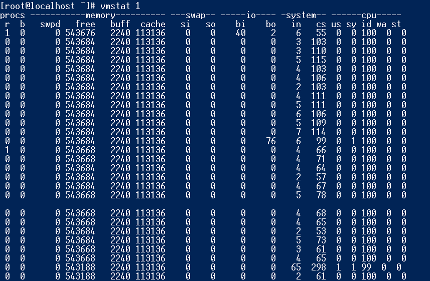
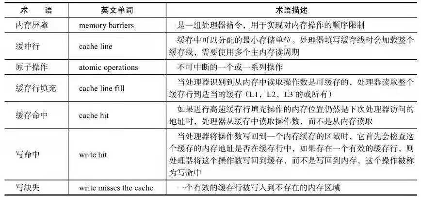

# 并发编程的挑战
## 上下文切换
- 即使是单核处理器也支持多线程执行代码，CPU通过给每个线程分配CPU时间片来实现这个机制。时间片是CPU分配给各个线程的时间，因为时间片非常短，所以CPU通过不停地切换线程执行，让我们感觉多个线程是同时执行的，时间片一般是几十毫秒（ms）。
CPU通过时间片分配算法来循环执行任务，当前任务执行一个时间片后会切换到下一个任务。但是，在切换前会保存上一个任务的状态，以便下次切换回这个任务时，可以再加载这个任务的状态。所以任务从保存到再加载的过程就是一次上下文切换。
这就像我们同时读两本书，当我们在读一本英文的技术书时，发现某个单词不认识，于是便打开中英文字典，但是在放下英文技术书之前，大脑必须先记住这本书读到了多少页的第多少行，等查完单词之后，能够继续读这本书。这样的切换是会影响读书效率的，同样上下文切换也会影响多线程的执行速度。
### 多线程一定快吗？
下面的代码并发执行一定比串行执行快吗？

    class ConcurrencyTest {
        private static final long count = 10000L;
        public static void main(String[] args) throws InterruptedException {
            concurrent();
            serial();
        }
    
        private static void concurrent() throws InterruptedException {//并行执行
            long start = System.currentTimeMillis();
            Thread thread = new Thread(new Runnable() {//1.创建
                @Override
                public void run() {
                    int a = 0;
                    for(long i=0; i< count; i++){
                        a += 5;
                    }
                }
            });
            thread.start();
            int b = 0;
            for(long i=0; i<count; i++){
                b--;
            }
            long time = System.currentTimeMillis() - start;
            thread.join();//2.上下文切换
            System.out.println("concurrent:" + time + "ms, b="+b);
        }
    
        private static void serial() {//串行执行
            long start = System.currentTimeMillis();
            int a = 0;
            for(long i=0; i< count; i++){
                a += 5;
                    }
            int b = 0;
            for(long i=0; i<count; i++){
                b--;
            }
            long time = System.currentTimeMillis() - start;
            System.out.println("serial:" + time + "ms, b=" + b + ",a=" + a);
        }
    }
### 上述问题的答案是"不一定"，测试结果如表所示

### 测试上下文切换次数和时长
- Lmbench可以测量上下文切换的时长
- vmstat可以测量上下文切换的次数
    - vmstat 提供以下信息：
            - procs 部分提供了在生成报告时正在运行的进程数目(r)以及被阻塞的进程数目(b)。
        可以利用这些信息来检查运行中以及阻塞进程的数目是否与预期值相符。如果与
        预期不符的话，可以检查：应用和内核的参数、系统调度器和 I/O 调度器、进程
        在可用处理器之间的分布等。
            - memory 部分提供了换出内存(swpd)、空闲内存(free)、I/O 数据结构的缓冲区缓存
        (buff)，以及从磁盘读取文件的内存缓存(cache)的容量，单位为 KB。swpd 的取
        值反映了 kswapd 的活动情况。
            - swap 部分提供了从磁盘上换入的内存容量(si)以及换出到磁盘上的内存量(so)，单位
        为 KB/s。so 反映了当数据被换出至交换区时 kswapd 的活动情况，而 si 则反映
        了当页面被换回到物理内存时发生页面错误的情况。
            - io 部分提供了从设备读入的块数(bi)以及写出到设备上的块数(bo)，单位为 KB/s。当
        运行 I/O 密集的应用时，应特别注意这两个部分的值。
            - system 部分提供了每秒的中断数目(in)和上下文切换数目(cs)。
            - cpu 部分提供了用户(us)、系统(sy)、真正空闲(id)以及等待 I/O 完成(wa)在 CPU 总时
        间中所占的百分比。CPU 利用率也许是最常用的量度。若 wa 值过大，则应该检
        查 I/O 子系统，例如，可以断定需要更多的 I/O 控制器和磁盘以便减少 I/O 等
        待时间。
    
    - CS（Content Switch）表示上下文切换的次数，从上面的测试结果中我们可以看到，上下文每1秒切换100多次。
    

### 如何减少上下文切换
- 无锁并发编程：多线竞争锁时，会引起上下文切换，所以多线程处理数据时，可以用一些办法来避免使用锁，如将数据的ID按照Hash算法取模分段，不同的线程处理不同的数据。
- CAS算法，Java的Atomic包使用CAS算法来更新数据，而不需要加锁
- 使用最少线程，任务少，创建了很多线程来处理，这样会造成大量线程都处于等待状态
- 协程，在单线程里实现多任务调度，并在单线程里维持多个任务间的切换

### 减少上下文切换实战
本节将通过减少线上大量WAITING的线程，来减少上下文切换次数。
- 第一步：用jstack命令dump线程信息，看看pid为3117的进程里的线程都在做什么。
  /opt/ifeve/java/bin/jstack 31177 > /home/admin/dump
- 第二步：统计所有线程分别处于什么状态，发现300多个线程处于WAITING（onobject-monitor）状态。
- 打开dump文件查看处于WAITING（onobjectmonitor）的线程在做什么。发现这些线程基本全是JBOSS的工作线程，在await。说明JBOSS线程池里线程接收到的任务太少，大量线程都闲着。
- 减少JBOSS的工作线程数，找到JBOSS的线程池配置信息，将maxThreads降到100。
- 第五步：重启JBOSS，再dump线程信息，然后统计WAITING（onobjectmonitor）的线程，发现减少了175个。WAITING的线程少了，系统上下文切换的次数就会少
    - 因为每一次从WAITTING到RUNNABLE都会进行一次上下文的切换。读者也可以使用vmstat命令测试一下。

## 死锁
案例代码，使线程t1和线程t2互相等待对方释放锁：

    public class DeadLockDemo {
        private static String A = "A";
        private static String B = "B";
    
        public static void main(String[] args) {
            new DeadLockDemo().deadlock();
        }
    
        public void deadlock() {
            Thread t1 = new Thread(new Runnable() {
                @Override
                public void run() {
                    synchronized (A) {
                        try {
                            Thread.currentThread().sleep(2000);
                        } catch (InterruptedException e) {
                            e.printStackTrace();
                        }
                        synchronized (B) {
                            System.out.println(Thread.currentThread().getName() + ": 1");
                        }
                    }
                }
            });
    
            Thread t2 = new Thread(new Runnable() {
                @Override
                public void run() {
                    synchronized (B) {
                        synchronized (A) {
                            System.out.println(Thread.currentThread().getName() + ": 2");
                        }
                    }
                }
            });
            t1.setName("T1");
            t2.setName("T2");
            t1.start();
            t2.start();
        }
    }
一旦出现死锁，业务是可感知的，因为不能继续提供服务了，那么只能通过dunmp线程查看到底是哪个线程出现了问题。

#### 现在我们介绍避免死锁的几个常见方法:
- 避免一个线程同时获取多个锁
- 避免一个线程在锁内同时占用多个资源，尽量保证每个锁只占用一个资源
- 尝试使用定时锁，使用lock.tryLock(timeout)来替代使用内部锁机制
- 对于数据库锁，枷锁和解锁必须在一个数据库连接里，否则会出现解锁失败的情况

## 资源限制的挑战：
- 什么是资源限制
    - 进行并发编程时，程序的执行速度受限于计算机硬件资源或软件资源。
        - 网络i/o
        - 硬盘i/o
        - CPU的处理速度
        - 数据库连接数
        - socket连接数
- 资源限制引发的问题
    - 并发执行受限于资源，由于增加了上下文切换和资源调度的时间，反而程序执行的更慢
- 如何让解决资源限制的问题
    - 硬件资源限制，集群并行执行程序，就让程序在多机上运行，ODPS、Hadoop等集群，不同的机器处理不同的数据
    - 软件资源限制，可以使用资源池将资源复用
- 在资源限制情况下进行并发编程
    - 根据不同的资源限制调整程序的并发度，比如，数据库连接数限制，线程数量就会被阻塞，等待数据连接

# Java并发机制的底层实现原理
Java代码-->（编译）--Java字节码-->（类加载器加载到JVM）-->JVM执行字节码-->汇编指令-->CPU上执行
- JVM实现
- CPU的指令
## 2.1 volatile的应用
- volatile是轻量级的synchronized，它在多处理器开发中保证了共享变量的“可见性”。
- 可见性的意思是当一个线程修改一个共享变量时，另外一个线程能读到这个修改的值。
- 如果volatile变量修饰符使用恰当的话，它比synchronized的使用和执行成本更低，因为它不会引起线程上下文的切换和调度。
### volatile的定义与实现原理
- 如果一个字段被声明成volatile，Java线程内存模型确保所有线程看到这个变量的值是一致的。
    - 与其实现原理相关的CPU术语与说明
    
    - volatile是如何保障可见性的呢？
## 2.2 synchronized的实现原理与应用
- 如果一个字段被声明成volatile，Java线程内存模型确保所有线程看到这个变量的值是一致的。
## 2.3 原子操作的实现原理
