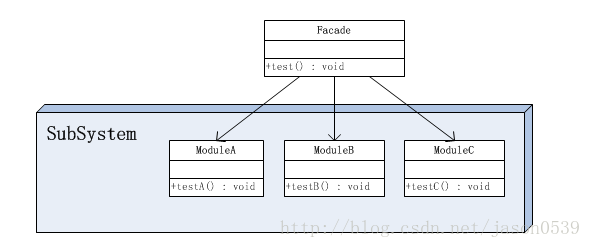
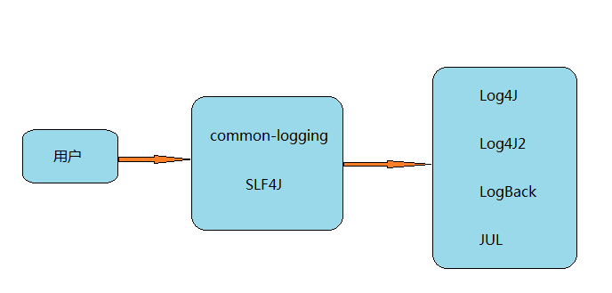

# JCL、SLF4J、Log4J、Log4J2、LogBack和JUL之间的关系，你搞清楚了吗？
## 写在前面
日志组件是我们平时开发过程中必然会用到的组件。在系统中正确的打印日志至少有下面的这些好处：

调试：在程序的开发过程中，必然需要我们不断的调试以达到程序能正确执行的状态 。记录日志可以让开发人员清楚的了解程序的运行状态定位问题；
信息收集：在DT时代，谁掌握了数据谁就掌握了主动权。现在主流的日志系统可以非常方便的记录用户行为数据，格式化成便于进行大数据分析的格式；
记录运行状态：应用程序投产之后，难免会出现生产事故，有了系统日志工程师可以根据日志迅速定位问题。
当然，硬币都具有两面性。引入日志组件也并不是没有缺点。

代码冗余：光从实现业务逻辑的角度来讲，在应用程序中插入打印日志的代码打印一大堆日志是完全没必要的，这在一定程度上降低了代码的可读性；
降低系统性能：这点很容易理解，因为需要进行日志打印处理，所以系统的运行速度肯定会有所降低。
综合比较日志组件优缺点，我们发现引入日志组件还是非常有必要的。

在我们平时的开发过程中，常用的日志组件有Log4J、Log4J2和LogBack等。代码中，我们一般都是像下面这样使用它们的。

>import org.slf4j.Logger;
import org.slf4j.LoggerFactory;
import org.springframework.boot.SpringApplication;
import org.springframework.boot.autoconfigure.SpringBootApplication;

>@SpringBootApplication
@EnableAdminServer
public class AppQuickStart {
    private static Logger logger = LoggerFactory.getLogger(AppQuickStart.class);
    public static void main(String[] args) {  
        System.out.println(Thread.currentThread().getName());  
        logger.info("app begin to start..."); 
        SpringApplication.run(AppQuickStart.class, args); 
        logger.info("app start success...");
    }
}

或者是像下面这样

>import org.apache.commons.logging.Log;
import org.apache.commons.logging.LogFactory;
import org.springframework.boot.SpringApplication;
import org.springframework.boot.autoconfigure.SpringBootApplication;

>@SpringBootApplication
@EnableAdminServer
public class AppQuickStart {
    private static final Log logger = LogFactory.getLog(AppQuickStart.class);  
    public static void main(String[] args) {  
        System.out.println(Thread.currentThread().getName());  
        logger.info("app begin to start...");  
        SpringApplication.run(AppQuickStart.class, args);  
        logger.info("app start success...");
    }
}

上面的两段代码很相似，是我们引入日志的模板代码，唯一有区别的地方是第一段代码引入了SLF4J的Jar包，第二段代码引入了common-logging的Jar包（后面简称JCL）。

刚开始接触日志组件的时候，我对这样的使用方式感到很疑惑：我们不是要用使用Log4J或者是LogBack打日志么，怎么完全没见到Log4J和LogBack的影子，反而有冒出来两个新框架SLF4J和common-logging。

那么这两个框架到底有什么作用？和Log4J、Log4J2还有LogBack又是什么关系？如果你也有这样的疑问，说明你还是善于思考的。今天的文章就来介绍下JCL、SLF4J、Log4J、Log4J2、LogBacky以及JUL（JUL的存在感很低，哈哈~）之间的关系。

## 门面模式
学过设计模式的同学都会知道在23种设计模式中有一种模式叫门面模式。

以上是门面模式的结构图。

在这个结构图中，出现了两个角色：

门面(Facade)角色 ：客户端可以调用这个角色的方法。此角色知晓相关的（一个或者多个）子系统的功能和责任。在正常情况下，本角色会将所有从客户端发来的请求委派到相应的子系统去。
子系统(SubSystem)角色 ：可以同时有一个或者多个子系统。每个子系统都不是一个单独的类，而是一个类的集合（如上面的子系统就是由ModuleA、ModuleB、ModuleC三个类组合而成）。每个子系统都可以被客户端直接调用，或者被门面角色调用。子系统并不知道门面的存在，对于子系统而言，门面仅仅是另外一个客户端而已。
使用门面模式具有以下优点

松散耦合: 门面模式松散了客户端与子系统的耦合关系，让子系统内部的模块能更容易扩展和维护。
简单易用: 门面模式让子系统更加易用，客户端不再需要了解子系统内部的实现，也不需要跟众多子系统内部的模块进行交互，只需要跟门面类交互就可以了。
更好的划分访问层次: 通过合理使用Facade，可以帮助我们更好地划分访问的层次。有些方法是对系统外的，有些方法是系统内部使用的。把需要暴露给外部的功能集中到门面中，这样既方便客户端使用，也很好地隐藏了内部的细节。
## JCL和SLF4J
为什么要介绍上面的门面模式呢？因为现今主流的日志组件都是使用门面模式实现的。而JCL和SLF4J就是门面模式中的Facade角色。

JCL官网对JCL的介绍：

The Logging package is an ultra-thin bridge between different logging implementations. A library that uses the commons-logging API can be used with any logging implementation at runtime. Commons-logging comes with support for a number of popular logging implementations, and writing adapters for others is a reasonably simple task. ——JCL官网

上面英文的大致意思是：JCL是不同日志实现之间的一座“桥梁”，JCL支持许多主流的日志实现。而且自己编写JCL的适配代码也很简单。

## SLF4J的介绍：

The Simple Logging Facade for Java (SLF4J) serves as a simple facade or abstraction for various logging frameworks (e.g. java.util.logging, logback, log4j) allowing the end user to plug in the desired logging framework at deployment time. —— SLF4J官网

上面英文的大致意思是：SLF4J充当不同日志框架门面的角色，让用户可以自由切换底层的日志实现。

通过上面的介绍，我们可以知道JCL和SLF4J都是日志门面（Facade），而Log4J、Log4J2和LogBack都是子系统角色（SunSystem），也就是具体的日志实现框架。他们的关系如下。

使用日志门面引入日志组件的最大优势是：将系统和具体的日志实现框架解耦合。

假如说我们不使用日志门面，直接使用特定的日志框架（比如说Log4J）的API进行编程，那么我们势必会在每个类中都耦合Log4J的API，如果你的系统一直使用Log4j作为日志实现，那OK。一旦有一天你老板心血来潮觉得Log4J不能满足系统的需求了（这边只是举个栗子，Log4J还是很强大_），指派你将Log4J更换成其他的日志实现。我想此刻的你一定会有点懵逼。因为你需要修改每个类中耦合的Log4J API。

如果使用JCL或者SLF4J等日志门面很好的帮我们解决了这种问题，我们不需要修改代码，只需要更换日志实现框架即可。

## Log4J、Log4J2和LogBack的有趣历史
使用过Log4J和LogBack的同学肯定能发现，这两个框架的设计理念极为相似，使用方法也如出一辙。

其实这个两个框架的作者都是一个人，Ceki Gülcü，俄罗斯程序员。

Log4J 最初是基于Java开发的日志框架，发展一段时间后，作者Ceki Gülcü将Log4j捐献给了Apache软件基金会，使之成为了Apache日志服务的一个子项目。 又由于Log4J出色的表现，后续又被孵化出了支持C, C++, C#, Perl, Python, Ruby等语言的子框架。

然而，伟大的程序员好像都比较有个性。Ceki Gülcü由于不满Apache对Log4J的管理，决定不再参加Log4J的开发维护。“出走”后的Ceki Gülcü另起炉灶，开发出了LogBack这个框架（SLF4J是和LogBack一起开发出来的）。

LogBack改进了很多Log4J的缺点，在性能上有了很大的提升，同时使用方式几乎和Log4J一样，许多用户开始慢慢开始使用LogBack。

由于受到LogBack的冲击，Log4J开始式微。终于，2015年9月，Apache软件基金业宣布，Log4j不在维护，建议所有相关项目升级到Log4j2。

Log4J2是Apache开发的一个新的日志框架，改进了很多Log4J的缺点，同时也借鉴了LogBack，号称在性能上也是完胜LogBack。有兴趣的朋友可以测试下两者的性能。

这边顺带提下JUL这个日志组件。这个日志组件是JDK自带的日志框架。由于在使用便利性和性能上都欠佳，所以存在感一直不高。

## 简单总结
JCL和SLF4J功能一样，都是日志门面，使用它们引入日志组件的目的是将系统和具体的日志实现之间解耦；
Log4J、Log4J2 、LogBack和JUL都是具体的日志实现。使用时要和门面日志搭配使用。
## 参考
[SLF4J官网](http://www.slf4j.org/)  
[JCL官网](http://commons.apache.org/proper/commons-logging/)  
[JAVA设计模式之门面模式（外观模式）](https://www.runoob.com/w3cnote/facade-pattern-3.html)