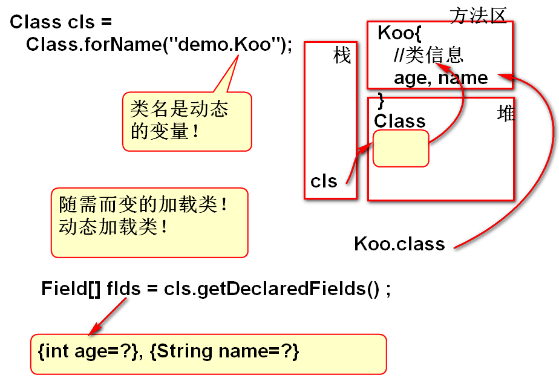

# 反射

常见框架的底层都使用了反射。

## 什么是反射（随需而变）

是Java的动态执行机制

> 按部就班：静态执行

> 随需而变：动态执行

## 按部就班-- 静态执行

代码:
	
	String str = new String("ABC");
	System.out.println(str.length());

	Koo k = new Koo();
	k.test();

## 随需而变 -- 反射

1. 动态加载类
2. 动态创建对象
3. 动态访问属性
4. 动态调用方法

> 反射是Java的API， 是Java内部带来了的。

### 动态加载类

代码：
	
	Class cls = Class.forName(类名);

案例：

	Scanner in = new Scanner(System.in);
	/**
	 * 从控制台读取被加载的类名：包名.类名
	 */
	String className = in.nextLine();
	/**
	 * 从硬盘上动态加载类"类名.class"。
	 * 类加载到方法区，返回变量cls代表加载的
	 * 结果。如果类名错误，Java反射API没有
	 * 找到相应的类文件，就抛出:类没有找到异常
	 */
	Class cls = Class.forName(className);
	//输出类加载的结果
	System.out.println(cls);

### 动态获取类的信息

类的信息：属性、方法、构造器...

#### 动态获取属性信息

代码

	Field[] flds = cls.getDeclaredFields() ;
	返回，类的属性信息（Filed 对象）
	每个Filed 对象代表类中的一个属性信息

案例:

	//动态加载类
	String className = "demo.Koo";
	Class cls = Class.forName(className);
	//动态获取类的 属性信息
	Field[] flds=cls.getDeclaredFields();
	//flds代表类的全部属性
	//Field类来自包：java.lang.reflect
	//利用增强for显示全部的属性信息
	for(Field f : flds){
		//f 代表类的中每个属性 信息
		System.out.println(f); 
	}

#### 动态获取方法信息

代码：

	//Method来自反射包：java.lang.reflect.*
	// Declared: 声明的
	Method[] methods=
			cls.getDeclaredMethods();

案例：

	//动态加载类
	String className = "demo.Koo";
	Class cls = Class.forName(className);
	//动态获取类信息
	//Method来自反射包：java.lang.reflect.*
	// Declared: 声明的
	Method[] methods=
			cls.getDeclaredMethods();
	//利用循环输出方法信息
	for(Method m : methods ){
		//m 代表类的每个方法信息
		System.out.println(m); 
	}

### 动态创建对象

在运行程序之前，“不知道类名”，在运行期间动态加载类，动态创建这个类的对象。

代码：

	//动态创建对象，cls引用了那个类的信息， 就创建这个类的对象！这个类必须有无参数构造器，否则将抛出异常!
	cls.newInstance() 
	
案例：

	String className = "demo.Koo";
	//java.io.BufferedInputStream 类没有无参数构造器
	//动态加载类
	Class cls = Class.forName(className);
	//动态创建对象
	//被创建对象的类必须有无参数构造器！
	//否则将出现无此方法的异常！
	Object obj = cls.newInstance();
	System.out.println(obj); 

### 动态调用方法

Method 类提供了API方法invoke，能够执行特定的方法

代码：
	
	m.invoke(obj, null);
	在obj对象上执行m方法
	m 和 obj是有关系的，obj对象上一定包含m方法，
	否则执行期间将抛出异常！！！

### 经典案例：JUnit3 原型案例

业务问题： 

	执行一个类中全部的以test为开头的无参数方法。
	(test开头的方法不是固定数量的方法)
	需要动态识别有哪些以test为开头的方法！

> 此案例中的类名不是确定的，被调用的方法名不是确定的， 这种情况下执行这些方法，必须使用反射API实现。

解决方案：

1. 动态加载类
2. 动态获取全部的方法信息
	- m.getName() 获取方法的名
3. 找到全部以test为开头的方法
	- String name = m.getName();
	- if(name.startsWith("test")){//}
4. 调用方法
	1. 创建对象：动态创建对象 cls.newInstance()	
	2. 执行方法：m.invoke(被调用方法的对象,null)
		- 执行了 对象.方法m

## 反射的优缺点
	
1. 灵活，动态执行 -- 优点
2. 性能差！-- 缺点

## 使用原则：

1. 能确定的调用执行关系，不要使用反射。
2. 当出现不确定的情况下（不知道类名，不知道属性名，不知道方法名）使用反射API，编码调用执行。

## 特殊用途：利用反射访问私有属性、方法

1. 加载类
2. 创建对象
3. 使用反射调用方法
	1. 先获取方法信息
	2. m.setAccessible(true) 打开默认的访问控制体系
	3. 使用 m.invoke(对象) //可以执行私有方法

案例：

	//动态加载类
	String className = "demo.Xoo";
	Class cls = Class.forName(className);
	//为了调用方法，需要先创建对象
	Object obj = cls.newInstance();
	//获取全部的方法信息
	Method[] methods=
		cls.getDeclaredMethods();
	for(Method m:methods){
		//System.out.println(m); 
		//m.setAccessible(true);“破坏了” 
		//原有的封装，在类的外部访问执行
		// "私有方法", 使用不多！！！ 
		m.setAccessible(true);
		m.invoke(obj, null);
	}

### 用反射执行特定的方法

找到一个类的特定方法，并且执行这个方法

1. 根据方法签名找到一个特定方法信息
	- 方法签名：方法名+参数列表
	- add {int, int}
	- add {long, int}
  
API 说明：
	
	getDeclaredMethod(方法名, 参数类型列表)
	返回值是一个特定方法信息
	Class cls = ....
	Method m = cls.getDeclaredMethod("add", 
		long.class, int.class)
	//调用了有参数的方法，返回值value是方法执行的
	//结果
	Object value = m.invoke(obj, 5L, 5)

代码：

	class Yoo{
		public int add(int a, int b){
			return a+b;
		}
		public long add(long a, int b){
			return a+b;
		}
	}

	//动态加载类
	String className = "demo.Yoo";
	Class cls = Class.forName(className);
	//动态创建对象
	Object obj = cls.newInstance();
	//找到一个特定方法
	Method m=cls.getDeclaredMethod(
		"add", long.class, int.class);
	//m 代表找到的特定方法信息。
	//执行方法
	Object val = m.invoke(obj, 5L, 5);
	//val 代表方法的执行结果。
	System.out.println(m); 
	System.out.println(val); 

--------------------------------------

## 作业

1. 用反射实现：
	- 调用一个类中全部的以demo为开头的无参数方法。
	- 这个类有无参数构造器。
	- 将参数方法的返回值输出到屏幕上。

2. 用反射调用 
	- 一个类中 方法名为 move的方法
	- 这个方法的参 double, int类型
	- 输出这个方法的执行结果

 

