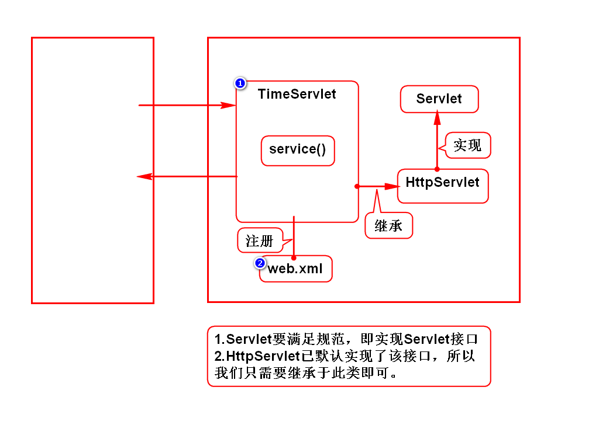

# 课程介绍
## 1.Servlet(*)
- Servlet使用步骤
- Servlet运行原理

## 2.JSP(*)
- JSP使用步骤
- EL
- JSTL

## 3.MVC模式(***)
- Servlet+JSP
- NETCTOSS项目(***)

## 4.其他
- Cookie
- Session(*)
- Filter(*)
- Listener

# Web应用的演变
## 规律
1. 单机向网络
2. CS向BS

## CS和BS的区别
- CS：Client Server，需要单独开发客户端，并让用户单独安装它。
- BS：Browser Server，用浏览器充当客户端，不需要单独开发和安装。

# Servlet介绍
## 服务器如何返回一个网页
### 1.静态网页
- 新闻页、百度百科
- 服务器保存一份HTML，直接返回给浏览器即可

### 2.动态网页
- 淘宝、QQ空间、微博
- 服务器保存一个组件，通过它动态拼一个HTML
- 在Java中这个组件就是Servlet
> 组件：满足规范的对象。

## Servlet的特征
1. Servlet是服务器端组件，必须保存在服务器上。
2. Servlet可以动态拼资源(HTML/IMG等)，即处理HTTP协议。
3. Servlet必须满足Sun的规范。

## 什么是Servlet
Servlet是Sun推出的，用来在服务器端处理HTTP协议的组件。

# 服务器
## 名称
- Java 服务器
- Java Web 服务器
- Servlet 容器

## 本质
- 是一个软件，需要安装在硬件上才能用
- 和浏览器是平级的关系

## 举例
- Tomcat(Apache)
- JBOSS
- WebLogic
- WebSphere

# 如何使用Tomcat
## 1.独立运行
### 下载及安装
- 在Tomcat官网下载压缩包，解压缩后直接使用。
- 学生机上已安装好：/home/soft01/tts9/apache-tomcat-7

### 配置环境变量
- 配置JAVA_HOME
- 学生机上已经配置好了

### 启动Tomcat
- chmod +x *sh
- Linux：打开/tomcat/bin，终端输入命令./startup.sh
- Windows：打开/tomcat/bin，双击startup.bat

### 访问Tomcat
- 打开浏览器，输入网址 http://localhost:8080
- 回车后，看到一只猫则代表访问成功

### 关闭Tomcat
- Tomcat不用时要关闭，避免重复启动出现问题
- Linux：打开/tomcat/bin，终端输入命名./shutdown.sh
- Windows：打开/tomcat/bin，双击shutdown.bat

> 软件上线时

## 2.使用Eclipse运行Tomcat
- doc.tedu.cn/tomcat
> 开发阶段

## Tomcat端口被占用问题
### 错误信息
- Address already in user, JVM_BIND 8080

### 重复启动Tomcat
- 手动shutdown

### 其他软件占用此端口(如Oracle)
- 修改/tomcat/conf/server.xml，65行的port="8080"
- 修改Servers/Tomcat7/server.xml，该文件和上面是一个

# Servlet开发步骤
## 1.创建WEB项目
- 目录：webapp/WEB-INF/web.xml

## 2.导入jar包
- 通过maven导入jar包，搜javaee
- 使用服务器自带的jar包，右键项目->target runtime->勾选tomcat

## 3.创建Servlet
- 实现Servlet接口
- 也可以继承HttpSevlet，此类已实现了Servlet接口
- 实现/重写service()，在此方法内动态拼HTML

## 4.注册Servlet
- 注册Servlet，并声明别名
- 通过别名，给此Servlet注册网名(以/开头)

## 5.部署项目
- 在Servers下选择Tomcat，右键Add and Remove
- 在弹出框内左侧选中项目，双击移动到右侧
> 部署：就是拷贝

## 6.访问Servlet
- 启动Tomcat
- 浏览器输入地址 http://ip:port/项目名/Servlet网名

## 7.重新部署
- 修改代码后，需要重新部署并重启Tomcat才有效
- 点击Servers下面的Tomcat7，右键publish
- 可以手动关闭Tomcat,再启动它
- 也可以等待Eclipse自动重启Tomcat(Reloading...)

# Servlet执行过程

# HTTP协议
## 什么是HTTP协议
- 它规定了浏览器和服务器如何通信，以及通信时的数据格式。

## 如何通信
1. 建立连接
2. 发送请求
3. 接收响应
4. 关闭连接

## 数据格式
### 请求数据包
- 请求行：请求方式、Servlet网名、协议类型
- 消息头：数据的描述信息
- 实体内容：浏览器发送给服务器的数据

### 响应数据包
- 状态行：协议类型、状态码、状态
- 消息头：数据的描述信息
- 实体内容：服务器给浏览器发送的数据

## 对开发的要求
- 通信的方式已经由浏览器和服务器完成；
- 请求数据的打包由浏览器实现；
- 响应数据的打包由服务器实现；
- 开发需要提供浏览器发送给服务器的数据，以及服务器返回的数据；
- 服务器通过request对象接收请求数据；
- 服务器通过response对象向浏览器发送数据；

