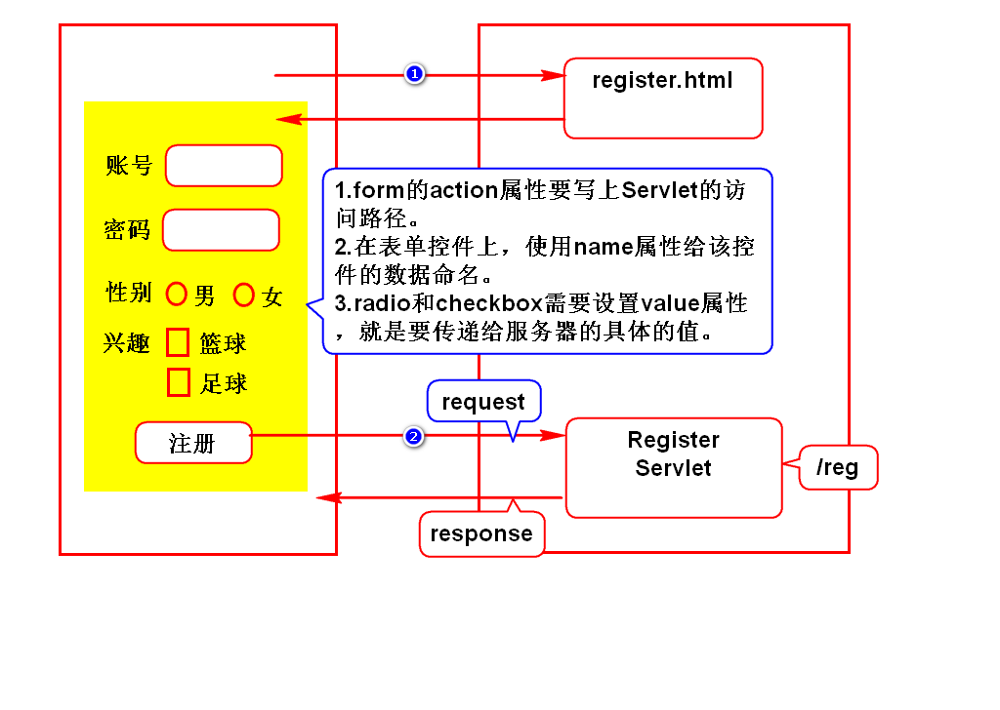
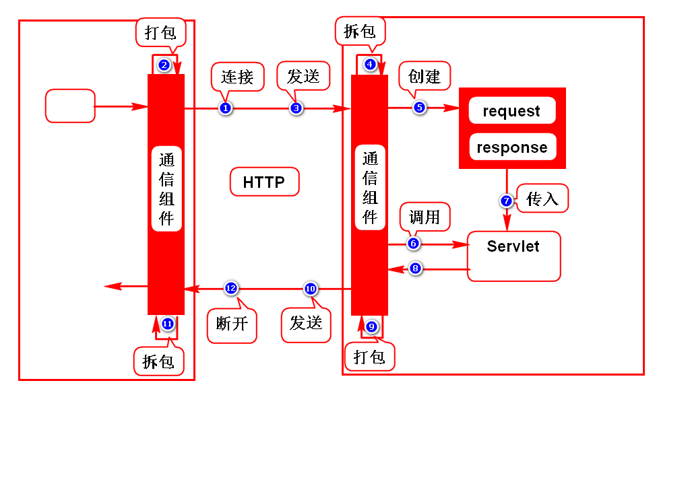
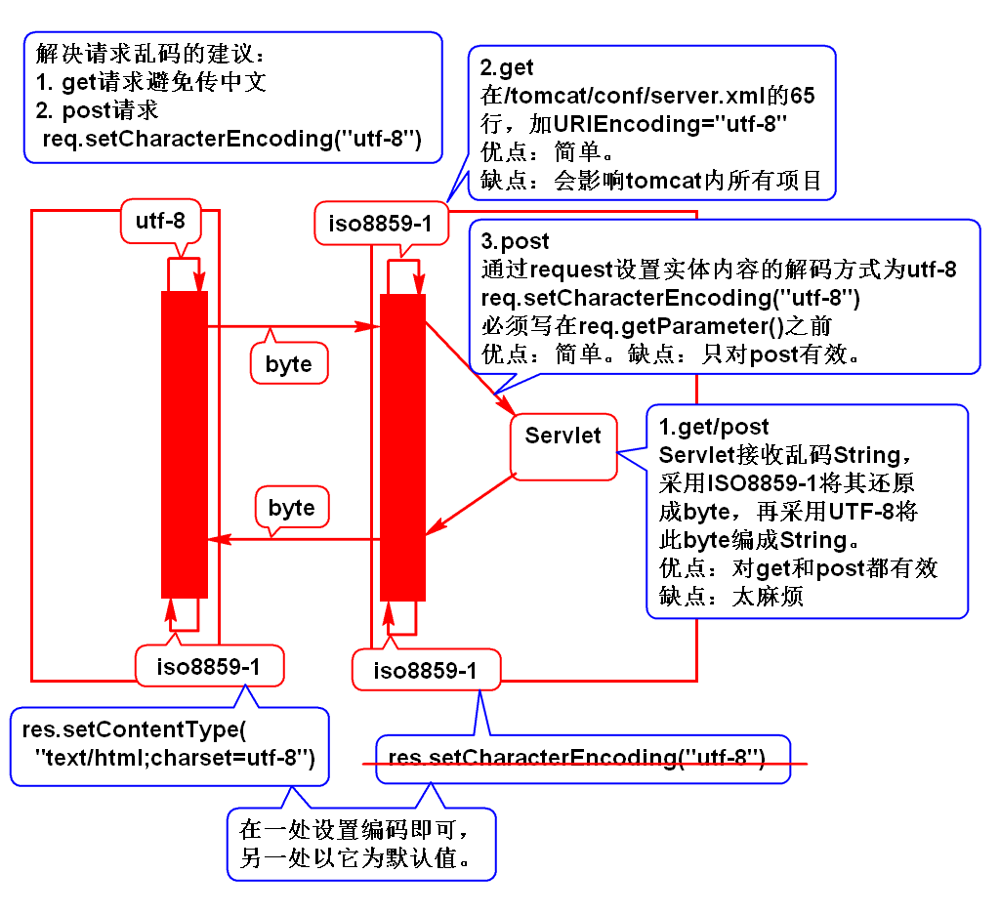
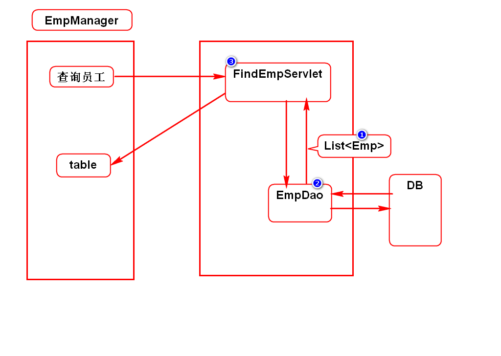
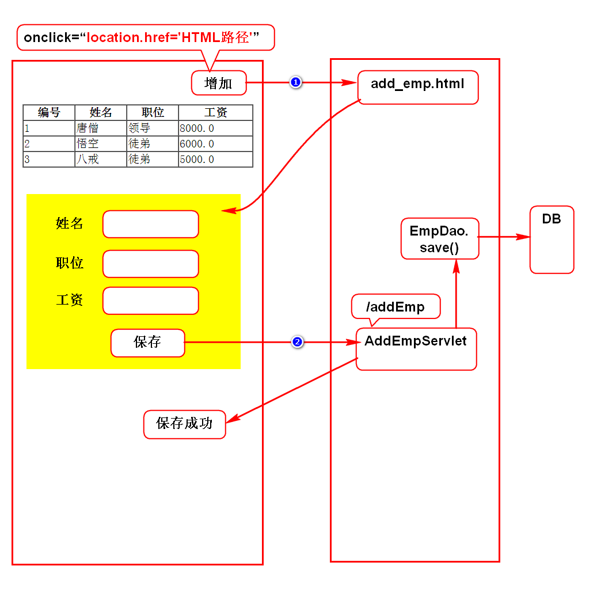

# 注册案例

# Servlet原理

# 请求方式
## 介绍
- 浏览器向服务器发送数据的方式
- 需要掌握GET和POST方式

## GET
- 默认情况下所有的请求都是GET请求
- 采用路径传参，即通过路径携带参数
- 传参过程中参数可见，隐私性差
- 因为路径大小有限制，所以能够传递的参数很小

## POST
- method="post"
- 采用实体内容传参
- 在传参的过程中，路径上看不到参数，隐私性好
- 实体内容专门用于传递数据，因此大小不受限制

## 使用场景
- 浏览器向服务器索取(查询)数据用GET请求
- 浏览器向服务器提交(保存)数据用POST请求

## 解决乱码问题

# 查询员工

# 增加员工

# day01-day02重点内容
1. Servlet开发步骤
2. Servlet运行原理
3. 如何解决请求乱码及响应乱码
4. 查询员工和增加员工案例
