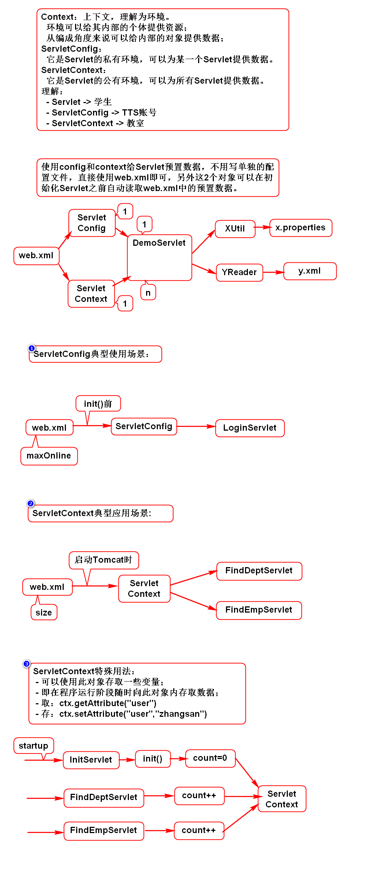
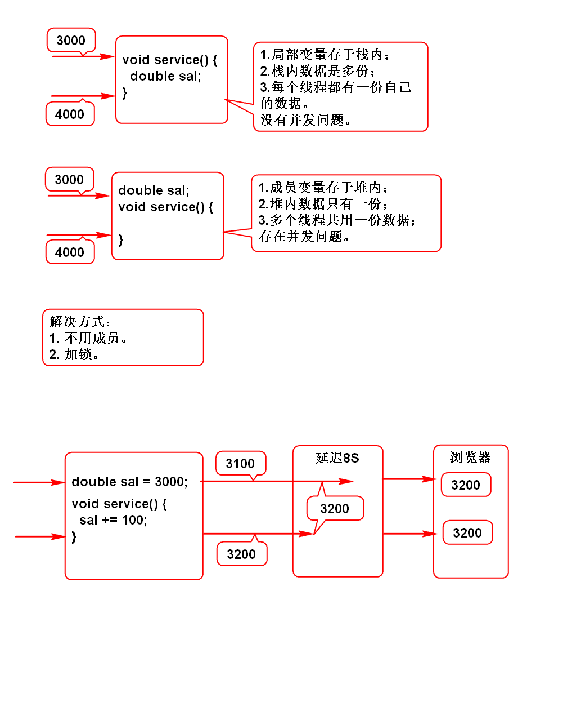
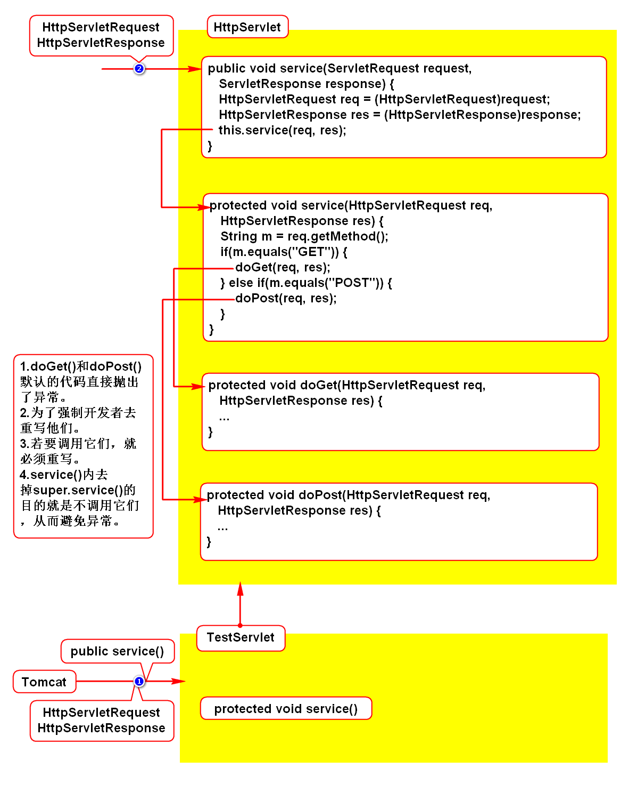
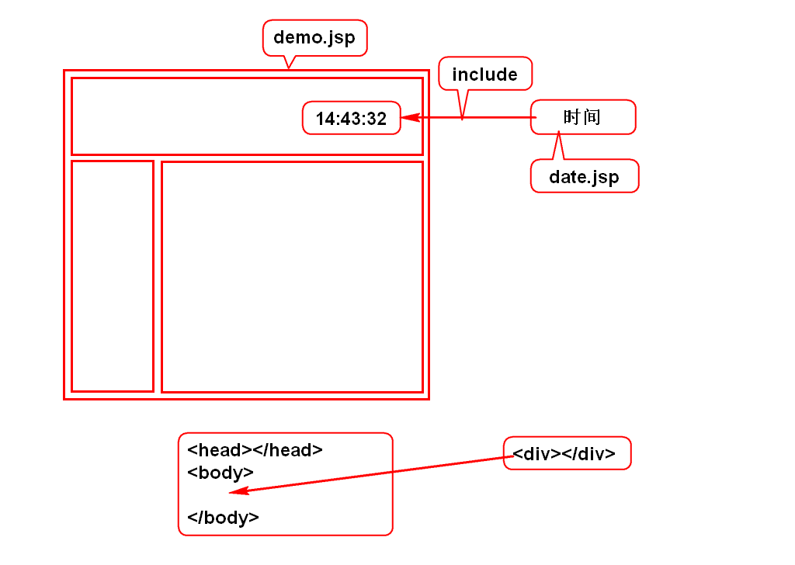
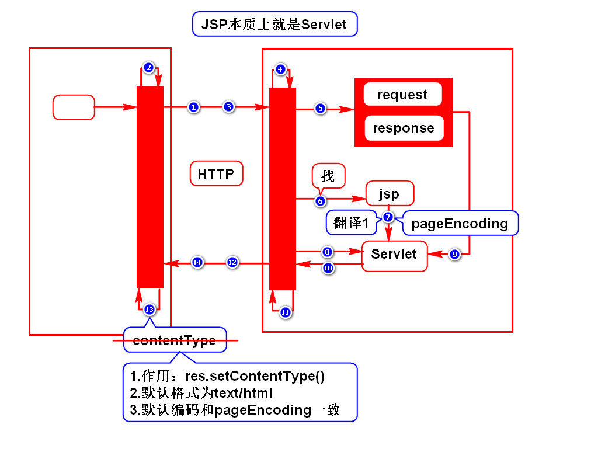
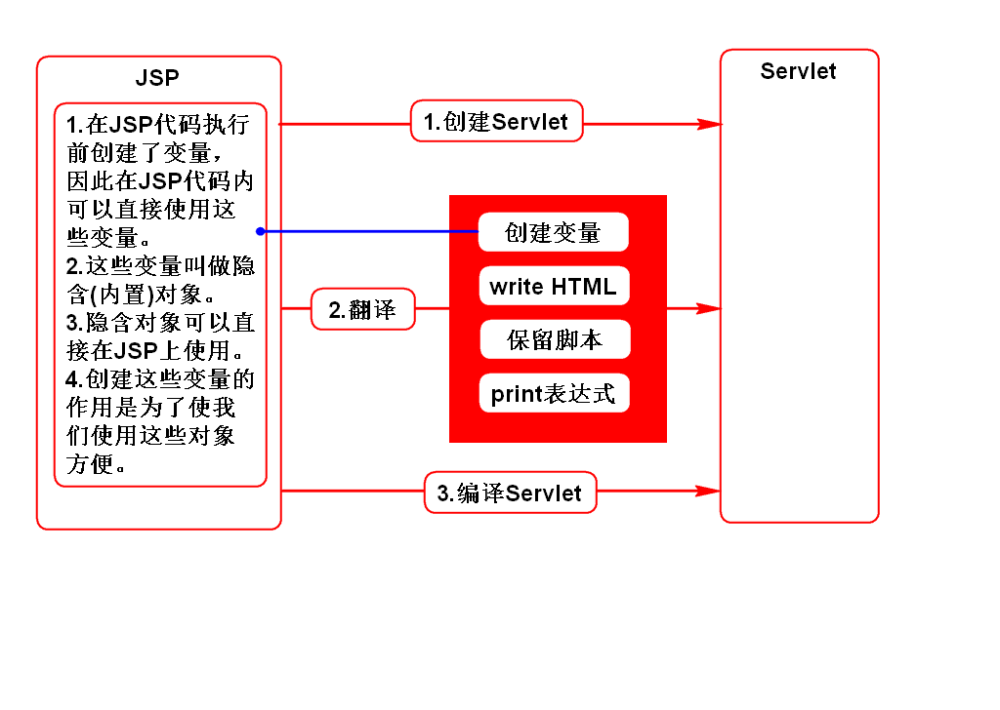
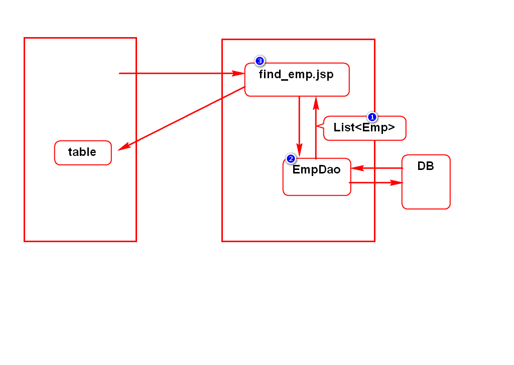

# ServletConfig和ServletContext

# 线程安全问题

# HttpServlet

# include

# JSP原理

# 翻译的过程

# 隐含(内置)对象
## 1.request(*)
- HttpServletRequest

## 2.response
- HttpServletResponse

## 3.out
- JspWriter
- 和PrintWriter一样

## 4.config
- ServletConfig

## 5.application
- ServletContext

## 6.exception
- Throwable
- 必须在发生异常时才能使用

## 7.session(*)
- HttpSession

## 8.page
- Object
- 就是对当前JSP的引用，其实就是对Servlet的引用
- 相当于this

## 9.pageContext(*)
- PageContext
- 页面的环境，可以给页面提供数据
- 通过该对象可以获取其他8个对象

## 使用示例
- <%String s = request.getParameter("user");%>
- <%=request.getParameter("user")%>

# 使用JSP开发员工查询

