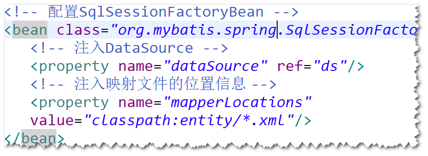

## 使用resultMap解决实体类的属性名与表的字段名不一致的情况。
step1.在映射文件当中，使用resultMap元素配置
实体类的属性名与表的字段名的对应关系。 
 
step2.在Mapper接口当中，声明相应的接口方法。 
 
step3.调用SqlSession.getMapper方法。 
 

# spring集成mybatis
## 编程步骤
step1. 导包。 
spring mvc(3.2.8),spring jdbc(3.2.8)
dbcp(1.4),oracle driver(ojdbc 14),junit(4.12),
mybatis(3.2.5),mybatis-spring(1.2.2) 
step2.配置文件。 
注：只需要spring配置文件(mybatis的配置文件中的配置信息
放到了spring的配置文件里面)。 
step3.实体类 
step4.映射文件 
step5.Mapper接口 
step6.修改spring配置文件，添加： 
a.SqlSessionFactoryBean 
负责创建SqlSessionFactory对象。需要为该对象
注入DataSource,映射文件的位置。 
 
b.MapperScannerConfigurer 
负责生成符合Mapper接口要求的对象，并将这些对象添加
到spring容器里面(对象的id是Mapper接口名首字母小写)。 
注：
可以为该对象设置annotationClass属性，其作用是，只扫描
带有特定注解的Mapper接口。 
 

## 使用SqlSessionTemplate
编程步骤：
前面5步同上。 
step6.修改spring配置文件，添加： 
a.SqlSessionFactoryBean 
负责创建SqlSessionFactory对象。需要为该对象
注入DataSource,映射文件的位置。 
b.配置SqlSessionTemplate 
 
c.配置组件扫描 
step7.写一个DAO类，注入SqlSessionTemplate。 
注：调用SqlSessionTempate方法即可。(类似于JdbcTemplate)。

